# Sistemas Multiagentes (SMA)

## 1. Introdução

### Agentes de Software

- “Um agente é um sistema informático situado em um ambiente que é capaz de realizar ações de forma **autônoma/independente** para conseguir seus **objetivos**.” [Wooldridhe, 1997]
- Por ser um paradigma ainda não aplicado em grande escala comercialmente falando, ainda não existe uma definição para agentes de software que seja precisa e utilizada por todos os pesquisadores. O que todos concordam…

### **Características**

- É capaz de atuar em um ambiente;
- Tem uma **visão parcial** do ambiente;
- É capaz de **perceber as mudanças** do ambiente;
- Pode **adaptar-se** às mudanças do ambiente (i.e. adaptabilidade);
- Pode comunicar-se usando troca de mensagens com outros agentes; → algoritmos de cooperação
- **Atua de forma autônoma**, sem a necessidade de ser mandado;
- Está **orientado** por um conjunto de comportamentos ou objetivos;
- Pode aprender, raciocinar e se movimentar;

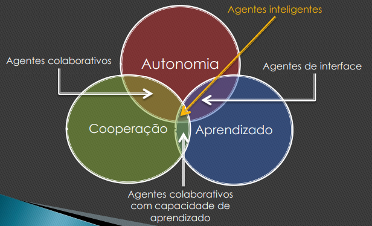

### **Conceitos relevantes**

1. Interatividade
    - A vida real é um ambiente multiagente, i.e, com vários agentes atuando, desempenhando ações.
    - Muitas vezes, os objetivos de um dado agente só podem ser cumpridos quando ocorre cooperação entre esse agente e outros.
    - Diferentemente dos objetos, os agentes não interagem chamando métodos de outros agentes, e sim e**nviando mensagens** a outros agentes.
    - Os agentes podem **decidir a quem irão responder**.
    - Um agente pode decidir não responder a uma mensagem de outro agente.
2. Autonomia
    - Um agente deve ser capaz de reagir diante de
    qualquer evento.
    - Um agente pode escolher com quem e de que
    forma deseja interagir.
    - Um agente deve ser capaz de adaptar-se diante da dinâmica do ambiente.

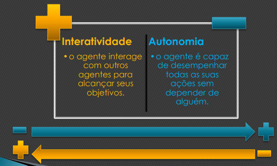

1. Reatividade
    - Importante propriedade, pois permite ao agente adaptar-se
    mesmo diante de um ambiente variável, mutável e evolutivo.
    - O agente pode atuar diante de   uma informação incompleta,
    em ambientes dinâmicos, mesmo que, na pior hipótese,
    precise falhar em seus objetivos.
    - Um agente reativo mantém uma interação contínua com o
    ambiente, e responde às mudanças ocorridas nesse ambiente, adaptando-se.
2. Proatividade
    - Reagir a um ambiente é fácil. Basta: Estímulo -> Resposta
    - Entretanto, queremos que os agentes façam coisas para nós, representem-nos ou representem outras entidades reais.
    - Um agente proativo, portanto, é capaz de atuar para cumprir seus objetivos, não sendo guiado exclusivamente pelos eventos do
    ambiente.
    - Esse agente tem iniciativa e reconhece oportunidades.

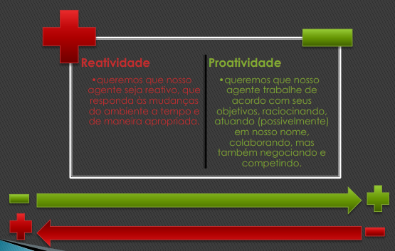

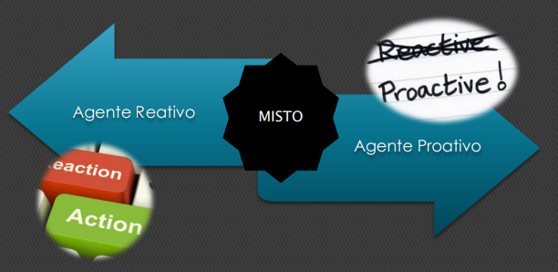

1. Outras propriedades
    - **Mobilidade** → capacidade de mover-se de um dispositivo para
    outro, em uma rede, preservando seu estado.
    - **Raciocínio →** capacidade do agente atuar para cumprir seus
    objetivos usando cognição, conhecimento adquirido diante do contexto. Portanto, um agente pode decidir:
        - que objetivo tentar atingir ou a qual evento reagir;
        - como atuar para conseguir um objetivo;
        - suspender ou abandonar um objetivo para se dedicar a outro.
            - reasing
    - **Aprendizagem →** capacidade do agente de melhorar seu desempenho com o passar do tempo, de forma evolutiva.
        - learning → machine learning, deep learning

### Comparação

**Orientação à Objetos**

**Estado** 

- Pode, normalmente, modificar, mas não adicionar novas Informações.

**Comportamento** 

- Não tem controle de seu
comportamento.
- Necessita estímulos externos para
executar.
- Responde todas as mensagens que
recebe.
- Comportamento predeterminado.

**Agente**

**Estado** 

- Guarda informações sobre seu comportamento
- Pode modificar e adicionar informação.

**Comportamento** 

- Tem controle de seu comportamento.
- Não necessita de estímulos externos para
executar.
- Pode não responder uma mensagem
- Pode modificar seu comportamento.

## 2. Sistemas Multiagentes (SMA)

### Definição

- Um conjunto de agentes de software desempenhando suas atividades de forma colaborativa.
- Esses agentes colaboram uns com os outros de acordo com uma organização, com o propósito de solucionar tarefas.
- Um Sistema Multiagentes pode ter a propriedade de mobilidade, o que agrega uma capacidade grandiosa aos agentes.
- Os agentes são responsáveis por interagir e desempenhar as atividades delegadas aos mesmos.
- A interação pode ocorrer entre os agentes e o ambiente e entre os próprios agentes, seguindo protocolos específicos.
- A organização está dentro do ambiente.
- O ambiente possui recursos que podem ser usados pelos agentes bem como pela organização visando concluir as tarefas.
- Os recursos também impactam na forma como essas tarefas devem ser desempenhadas.
- Cada um dos elementos (agentes, interação, organização e recurso) contém uma esfera de influência no ambiente em análise.

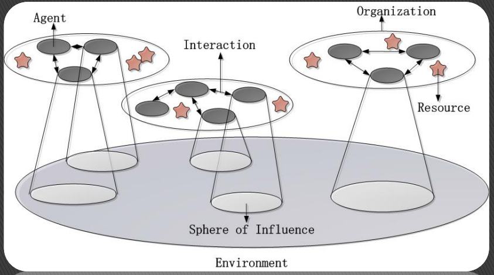

- vários agente, trocando mensagem, recursos (estrelas),

## SMA Comportamental

- behavior
- São Sistemas Multiagentes orientados por COMPORTAMENTOS.
- Os agentes desses sistemas têm
comportamentos (um ou mais), **deliberados**, preferencialmente, assincronamente, com base na análise do ambiente (ex. recursos
disponíveis) e nas demandas delegadas sob a responsabilidade dos agentes, bem como
guiadas pelos protocolos e princípios vigentes na organização.

### Exemplos

- Todos os exemplos oferecidos pela plataforma JADE, tais como:
    - BookBuyer & BookSeller,
    - Party,
    - dentre outros.
- Simuladores de Ecosystems;
- **Simuladores de Órgãos** (ex. pulmão, útero e coração) – Bio sistemas;
- Sistemas de Negociação (ex. Bolsa de Valores, Leilões Virtuais, e outros),

# 3. Evolução e tendências no paradigma

## Passado distante

- Objetos com cognição limitada “Agentes Reativos”
- Agentes Cognitivos atuando individualmente
- Agentes Comportamentais

### Investigando

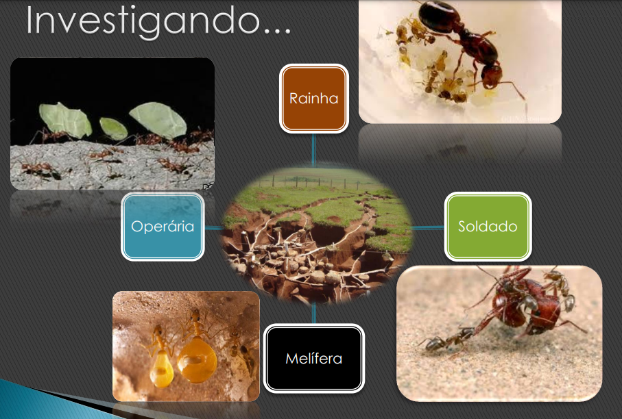

### Observação 1

- Em geral, as formigas seguem o menor caminho entre o formigueiro e sua fonte de alimento. Enquanto andam, as formigas depositam no solo uma substância chamada feromônio.
- Na presença de feromônio, elas possuem certa tendência a seguir o caminho marcado com a substância. Essa tendência é baseada na quantidade de feromônio presente em cada caminho: quanto maior concentração, maior a chance da trilha ser seguida.

- Inicialmente, como não há feromônio nos caminhos, as formigas andam aleatoriamente em busca de alimento. As formigas que escolhem (ao acaso) o
menor caminho voltam por ele. Como a ida e a volta são mais rápidas, há um pouco mais de feromônio nesse caminho.
    - Como essa trilha possui mais feromônio, outras formigas tendem a segui-la. Com
    isso, o feromônio na trilha irá aumentar.
        
        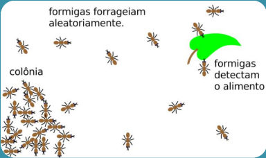
        

- Inicialmente, como não há feromônio nos caminhos, as formigas andam aleatoriamente em busca de alimento. As formigas que escolhem (ao acaso) o
menor caminho voltam por ele. Como a ida e a volta são mais rápidas, há um pouco mais de feromônio nesse caminho.
    
    
    

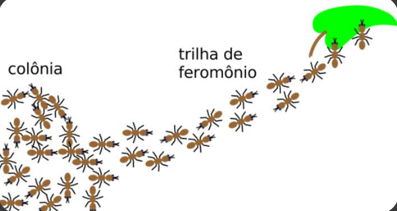

### Lições aprendidas

Os algoritmos de colônias de formigas…

- São aplicados a problemas representados por um grafo G(V, A).
- São algoritmos de construção: a cada iteração, cada formiga, individualmente, constrói uma
solução para o problema.
- São algoritmos que, a cada iteração, trabalham com uma população de formigas (e, portanto, com uma população de soluções).

O que levar em conta?

- Informações heurísticas (fixas), representando o problema em si, o qual será solucionado
encontrando, primeiramente, possíveis soluções, as quais são candidadas à melhor solução.
- A quantidade de feromônio (variável), que indica quão desejável é uma determinada
solução, ou seja, um determinado caminho.

### Observação 2

**Experimento da Ponte Binária** - Experimento realizado por Deneubourg et al., 1990, para estudar o comportamento das formigas.

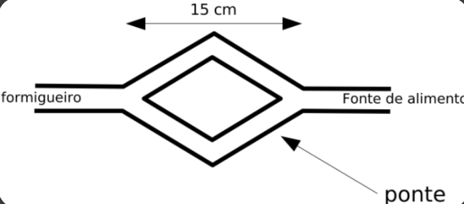

As formigas são deixadas livres para escolher o caminho. 

Não há feromônio ainda.

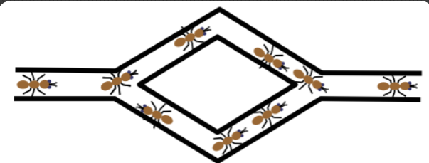

As formigas convergem para um dos caminhos com igual probabilidade.

Devido a flutuações aleatórias, uma das pontes terá mais feromônio e atrairá as formigas com maior probabilidade.

Continuando o Experimento das Pontes Binárias... Usando pontes de tamanhos diferentes, uma formiga percorre ida e volta na ponte curta no mesmo tempo que outra formiga realiza apenas o percurso de ida na ponte longa. 

Logo, será depositado mais feromônio na ponte curta do que na longa. Portanto, as formigas convergem para a ponte mais curta.

### Lições aprendidas

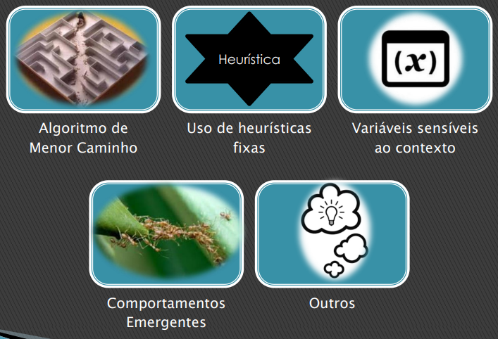

# Evolução

- Achei tudomuito mecânico!
- Onde está a inteligência?

**Comportamental**

Existem contextos que são intrinsecamente favoráveis para se representar usando a abstração de sistemas multiagentes comportamentais. 

Simuladores de formigas, de colônias de abellhas, de vespeiro, de matilhas, de órgãos humanos e muitos outros…

**Cognição**

Já existem outros contextos, não tão favoráveis assim para trabalhar usando como base a abstração de sistemas multiagentes comportamentais.

Normalmente, são contextos onde a cognição ganha força.

Existe uma necessidade muito grande de se trabalhar questões como planning, reasoning, learning e outras de forma mais detalhada.

# Passado recente:

## BDI

### Um olhar mais profundo...

- Raciocínio
- Aprendizado
- Planejamento
- Sensibilidade a Contexto
- Lógica
- Reputação
- Colaboração
- Adaptação

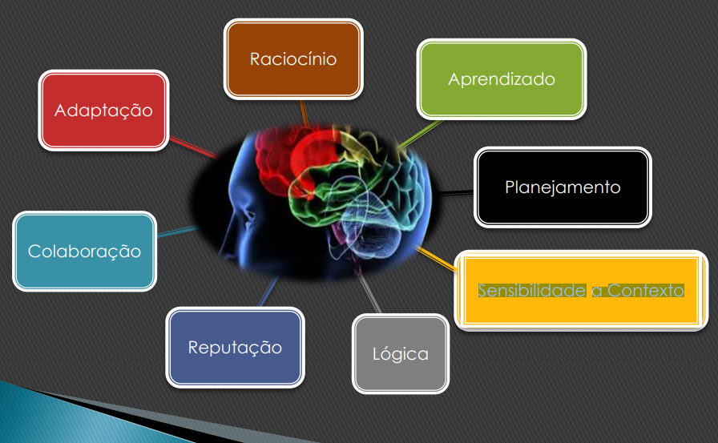

### Modelo Belief Desire Intention

- Metas
- Intenções
- Crenças

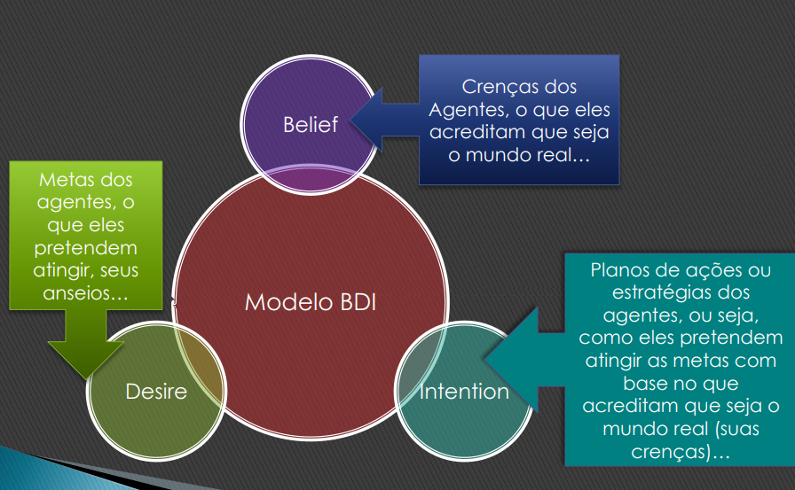

### Lições Aprendidas

- Primeiros passos para reasoning em tempo de execução
- Permite trabalhar com a ideia de times em larga escala
- Baseia-se em abstrações muito próximas da forma como o ser humano pensa e age

## DCOP e DEC-POMDPs

### Um olhar mais profundo...

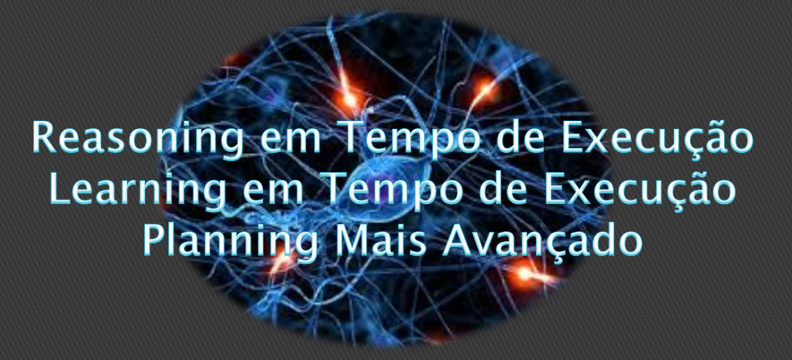

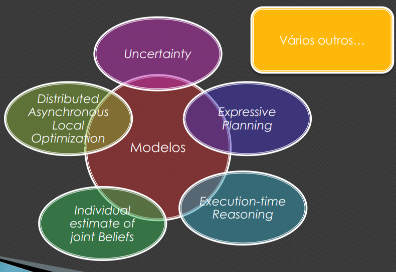

### Lições Aprendidas

- É possível avançar na questão de raciocínio em tempo de execução
- É possível trabalhar a ideia de combinar crenças
- É possível otimizar algoritmos que procuram lidar com times em larga escala

# Outras Tendências

### Atuação da Engenharia de Software

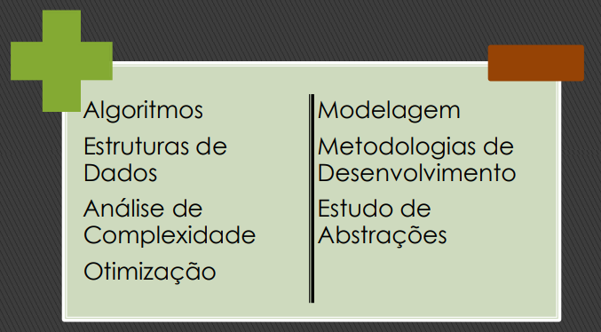

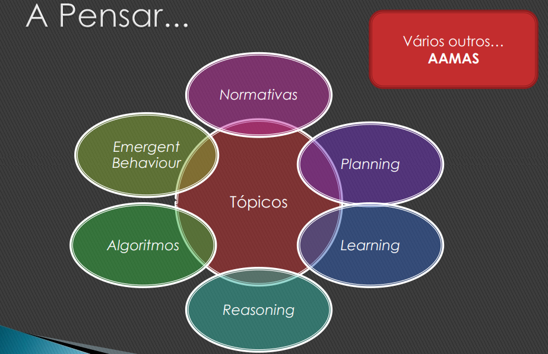

### AAMAS

- Conferência muito respeitada em sistemas multiagentes
- Essa conferência cobre várias macro áreas do Paradigma de Sistemas Multiagentes

# 4. Referências

- Java Agent DEvelopment Framework → [http://jade.cselt.it/](http://jade.cselt.it/)
- API de JADE →  [http://jade.cselt.it/doc/api/index.html](http://jade.cselt.it/doc/api/index.html)
- Documentação on-line de JADE → [http://jade.cselt.it/doc/index.html](http://jade.cselt.it/doc/index.html)
- Outros tutoriais de JADE
    - [http://agents.felk.cvut.cz/teaching/ui2/JADE_tutorial.htm](http://agents.felk.cvut.cz/teaching/ui2/JADE_tutorial.htm)
    - [http://www.soe.ucsc.edu/research/agents/borcon/index.html](http://www.soe.ucsc.edu/research/agents/borcon/index.html)
    - [http://www.ryerson.ca/~dgrimsha/courses/cps720/JADEAdmin/jadeSt](http://www.ryerson.ca/~dgrimsha/courses/cps720/JADEAdmin/jadeSt)
    art.html
    - [http://www.ryerson.ca/~dgrimsha/courses/cps720_02/courseTopics.ht](http://www.ryerson.ca/~dgrimsha/courses/cps720_02/courseTopics.ht)
    ml
    - [http://www.etse.urv.es/recerca/banzai/toni/MAS/material.html](http://www.etse.urv.es/recerca/banzai/toni/MAS/material.html)
- Livros Disponíveis Online
    - [http://homepages.abdn.ac.uk/w.w.vasconcelos/pages/teaching/CS4027/](http://homepages.abdn.ac.uk/w.w.vasconcelos/pages/teaching/CS4027/)
    abdn.only/jade_book.pdf
    - [http://www.cs.ox.ac.uk/people/michael.wooldridge/pubs/imas/IMAS2e.ht](http://www.cs.ox.ac.uk/people/michael.wooldridge/pubs/imas/IMAS2e.ht)ml
- Fóruns, Faqs e Mailing Lists
    - [http://stackoverflow.com/questions/tagged/agents-jade](http://stackoverflow.com/questions/tagged/agents-jade)
    - [http://jade.tilab.com/](http://jade.tilab.com/), clique em Community&Developers no menu
    superior, depois em faq no menu ao lado esquerdo.
    - [http://jade.tilab.com/](http://jade.tilab.com/), clique em Community&Developers no menu
    superior, depois em mailing lists no menu ao lado esquerdo.
    - Artigo com uma visão mais moderna sobre o paradigma: → [http://teamcore.usc.edu/MAAF/TwoDecadesMTR.pdf](http://teamcore.usc.edu/MAAF/TwoDecadesMTR.pdf)