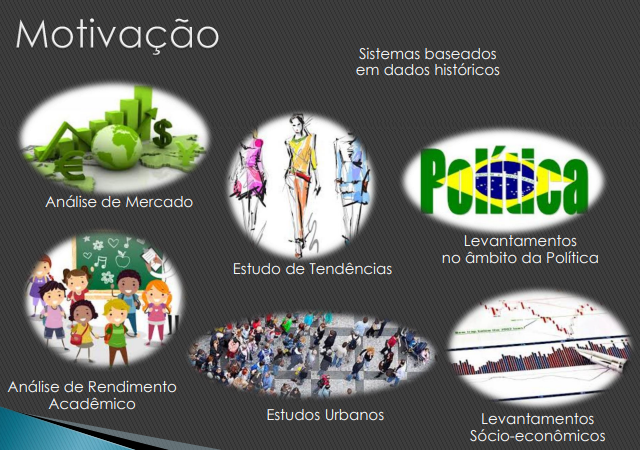

# MAS Comportamental

# Motivação

- Sistemas mistos, parte reativos, parte cognitivos.
- Sistemas associados a uma inteligência implícita.
- Sistemas apoiados nas noções de previsibilidade. Entretanto, permitindo manifestações de comportamento emergente.

# Principais Abstrações

# Modelando e Implementando

### Como abstrair

- Candidatos a agentes

### Como projetar

1. Ferramentas de Modelagem
    - UML tradicional
    - AUML
        - http://www.auml.org/
        - http://people.ucalgary.ca/~far/Lectures/SENG697/PDF/Odell-W001.pdf
        - http://marcphilippe.huget.free.fr/File/InternetComputing84.pdf
    - 
2. Metodologia 
    - Jade e Tropos - http://www.troposproject.org/ (i* e uml)
    - **Design Arquitetural → [3. Arquitetura](./3-arquitetura.md)**
        - **Nível BASE**: Arquitetura da Plataforma
        - **Nível INTERNO**: Arquitetura da Máquina de Raciocínio e Aprendizado dos seus agentes
        - **Nível TRANSVERSA**L: Arquitetura da sua aplicação em si

3. Metodologia
    - Jade

### Como desenvolver

### Comportamentos

1. Comportamento cíclico
    - Cyclic
    - Ticker → baseado em tempo
2. Comportamento ciclico baseado em tempo
3. Comportamento de uma ação só
    - Oneshot - provocado (próximo de um método) → nao é sequencial necessariamente
    - Receiver
    - waker → baseado em tempo
4. Comportamento executado em paralelo com outro
    - Parallel
5. Comportamento executado em sequência com outro
    - Sequencial

Passos:

- Experimentar cyclic e ticker, depois maker
- logo apos parallel e sequencial
- só depois basear em máquina de estados

