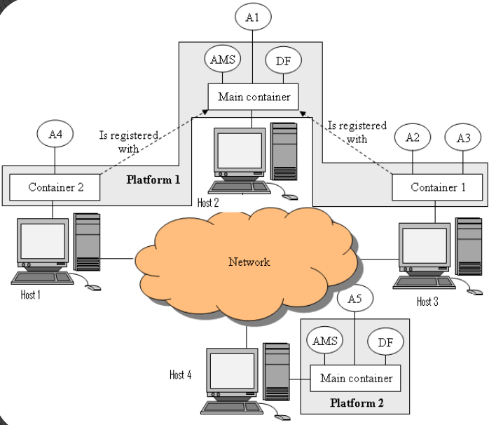
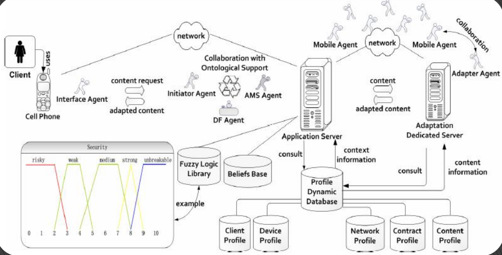
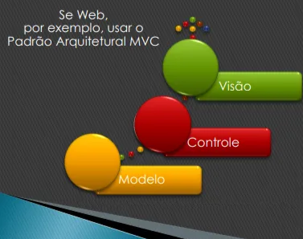
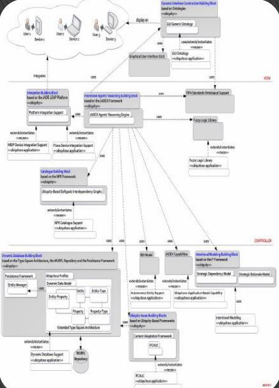

# Arquitetura SMA

## Design Arquitetural

### **1. Nível BASE: Arquitetura da Plataforma**

- Elementos da arquitetura
- Como o JADE trabalha?

Main container→ 

- Container princiapal com 3 agentes (AMS, DF, RMA)

Agentes

1. AMS → Páginas brancas
    - Conhece todo mundo
    - Ex: lista telefonica → **todos** os telefones
2. DF → Páginas amarelas
    - Não conhece todo mundo
    - Conhece quem se registra nele
    - Quem se registra? quem quer oferecer e buscar algo
    - Ex: lista telefonica → quem pagava mais para ter **destaque**
3. RMA → da ferramenta gráfica que controla

Passos 

- fazer uma aplicação com uma plataforma
- depois explorar mais quando conseguir como cria container, como desfaz como migra de um para o outro

### 2. Nível **INTERNO**: Arquitetura de Raciocinio e Aprendizado dos seus agentes

Como os agentes atuam, a modelos usados, servidores, envolvidos, etc

### 3. Nível **TRANSVERSAL**: Arquitetura da sua aplicação em si

