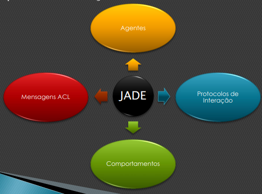
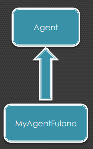

# JADE - Framework

## 1. Definição

- JADE - Java Agent DEvelopment Framework
- JADE é um framework para desenvolvimento de SMA
- Desenvolvido pelo CSELT e Universidade de Parma (Itália)
- Completamente implementado em Java
- Obedece às especificações da FIPA - Foundation for Intelligent
- Physical Agents (1997 / 2000)
- Pode ser visto como um middleware de agentes que implementa uma plataforma distribuída e um framework de desenvolvimento.

### Características

1. Lida com os aspectos que não fazem parte do negócio ou domínio no qual o agente em si desempenhará suas ações. 
    - Transporte de mensagens, codificação, parsing, ciclo de vida do agente, páginas brancas, páginas amarelas, ...
2. Provê ferramentas de suporte
    - Remote Monitoring Agent, Dummy Agent, Sniffer Agent,…
3. Foi projetado para dar suporte a **escalabilidade** de SMA

### Container

- Baseado no conceito de container - “Processo”
    - Um container seria como um “processo”...
    - Diferentes containers na mesma plataforma (1 JVM por container).
    - Diferentes agentes no mesmo container (ambiente multithreaded pré-emptivo, escalonado pela JVM).
    - Cada agente tem sua própria thread de execução.
    - Cada agente pode ter diferentes comportamentos.
- A própria plataforma detém o controle do tempo que será usado pelos processos (threads).

## 2. Ferramentas Gráficas

### Remote Monitoring Agent (RMA)

- Funciona como uma console gráfica para gerenciamento e controle da plataforma;
- É usada para monitorar e administrar o status de todos os componentes da plataforma distribuída, incluindo agentes e containers, e
- Serve para controlar o ciclo de vida dos agentes, conexões com plataformas remotas e a instalação de protocolos de transporte de mensagens.

### Sniffer Agent

- É usado para interceptar as mensagens ACL () e exibir a conversação através de uma notação similar ao diagrama de seqüência da UML;
- Útil para depuração de conversação entre agentes, e
- Permite que as conversações sejam salvas ou carregadas em arquivos.
- **Ve as interações → depuração**

### Introspector Agent

- É usado para monitorar o **ciclo de vida** de um agente, suas mensagens ACL trocadas e seus comportamentos em execução, e
- Permite controlar a execução de um agente

### Dummy Agent

- É uma ferramenta utilizada para compor e enviar mensagens ACL para outros agentes, bem como para exibir as mensagens recebidas, e
- Permite que as mensagens sejam salvas ou carregadas em arquivos.

### Directory Facilitator (DF)

- Representa o FIPA DF, o componente de **páginas amarelas** do sistema;
- Permite registrar / de-registrar / modificar / buscar agentes e serviços, e
- Permite criar confederações de DF e realizar propagação de busca através de domínios e subdomínios.

## 3. Implementação

### Agentes

- Um agente em JADE é uma instância da classe Agent
- Heranças da classe agente:
    - Características para realizar as interações básicas com
    a plataforma de agentes (registro, configuração, gerenciamento
    remoto, ...), e
    - O conjunto básico de métodos
    que podem ser chamados para implementar o comportamento
    personalizado do agente (enviar/receber mensagens, usar protocolos de interação, ... )

- Cada serviço/funcionalidade de um agente deve ser
implementado como um ou mais comportamentos;
- Os comportamentos de JADE modelam arquiteturas reativas, e
- A abstração de comportamento do modelo do agente de JADE permite a integração de produtos de software externos para enriquecer a arquitetura do agente.
    - Ex: agentes reativosdeliberativos com JADEX e JESS agentes mais cognitivos...
- A classe Agent representa os estados do agente através de constantes:
    - AP_INITIATED - Objeto Agente instanciado, mas não registrado no AMS
    - AP_ACTIVE - Agente iniciado e registrado no AMS
    - AP_SUSPENDED - Agente, no momento, suspenso, parado
    - AP_WAITING - Agente em modo de espera, bloqueado
    - AP_DELETED - Agente definitivamente “morto” : (
    - AP_TRANSIT - Agente móvel migrando
    - AP_COPY - Agente sendo clonado
    - AP_GONE - Agente móvel migrado
    
    
    
- Como JADE controla a criação de um novo agente?
    1. O construtor do agente é executado;
    2. Um AID (Agent Identifier) é atribuído ao agente;
        
        
        
    3. O agente é registrado no AMS (Agent Management System) - páginas brancas;
    4. O agente é colocado no estado AP_ACTIVE;
    5. O método setup() é executado.
        1. Deve ser implementado para inicialização de um agente;
        2. Deve adicionar pelo menos um comportamento para o agente através do método addBehaviour();
        3. Ao final da execução do método setup(), JADE executa automaticamente os comportamentos, a partir do que foi primeiramente declarado.

### Mensagens ACL

Em JADE, os agentes comunicam-se através de passagem assíncrona de mensagens ACL;

- A classe ACLMessage representa as mensagens de acordo com as especificações da FIPA (fipa000061);
- Todos os parâmetros são pares **palavra-chave: valor**
- Os valores dos parâmetros podem ser inseridos através dos métodos **set()** e podem ser lidos através de métodos **get()**, e
- As performativas da FIPA são identificadas por constantes.
- **Subsistema de comunicação de JADE**
    - Todo agente tem uma fila privada de mensagens ACL criada e preenchida pelo
    subsistema de comunicação de JADE;
    - Foi projetado como um camaleão para alcançar um menor custo de passagem
    de mensagens, e
    - Se uma mensagem é enviada e o subsistema não consegue encontrar o destinatário, ele a envia para ser gerenciada pelo AMS.

### Comportamentos

### Protocolos de Interação

