# JADE - Framework

## Introdução

- JADE - Java Agent DEvelopment Framework
- JADE é um framework para desenvolvimento de SMA
- Desenvolvido pelo CSELT e Universidade de Parma (Itália)
- Completamente implementado em Java
- Obedece às especificações da FIPA - Foundation for Intelligent
- Physical Agents (1997 / 2000)
- Pode ser visto como um middleware de agentes que implementa uma plataforma distribuída e um framework de desenvolvimento.
- Ele inclui:
  - Um **ambiente de tempo de execução** onde os agentes JADE podem “viver” e que devem estar ativos em um determinado host antes
que um ou mais agentes possam ser executados naquele host.
  - Uma **biblioteca** de classes que os programadores têm que/podem usar (diretamente ou especializando-os) para desenvolver
seus agentes.
  - Um conjunto de **ferramentas gráficas** que permite administrar e monitorar a atividade de agentes em execução

**Características**

1. Lida com os aspectos que não fazem parte do negócio ou domínio no qual o agente em si desempenhará suas ações. 
    - Transporte de mensagens, codificação, parsing, ciclo de vida do agente, páginas brancas, páginas amarelas, ...
2. Provê ferramentas de suporte
    - Remote Monitoring Agent, Dummy Agent, Sniffer Agent,…
3. Foi projetado para dar suporte a **escalabilidade** de SMA

**Container**

- Baseado no conceito de container - “Processo”
    - Um container seria como um “processo”...
    - Diferentes containers na mesma plataforma (1 JVM por container).
    - Diferentes agentes no mesmo container (ambiente multithreaded pré-emptivo, escalonado pela JVM).
    - Cada agente tem sua própria thread de execução.
    - Cada agente pode ter diferentes comportamentos.
- A própria plataforma detém o controle do tempo que será usado pelos processos (threads).

**Contêineres e plataformas**

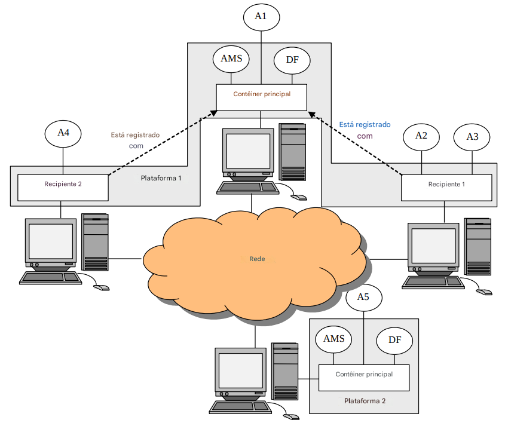
<center>Figura 1 - Contêineres e plataformas</center>

- Cada instância em execução do ambiente de execução JADE é chamada de Contêiner, pois pode conter vários agentes. 
- O conjunto de contêineres ativos é chamado de Plataforma. 
- Um único contêiner principal especial deve estar sempre ativo em uma plataforma e todos os outros contêineres se registram nele assim que são iniciados. 
- Segue-se que o primeiro contêiner a iniciar em uma plataforma deve ser um contêiner principal, enquanto todos os outros contêineres devem ser contêineres “normais” (ou seja, não principais) e devem “ser informados” onde encontrar (hospedar e portar) seu contêiner principal (ou seja, o contêiner
principal para se registrar).
- Se outro contêiner principal for iniciado em algum lugar da rede, ele constitui uma plataforma diferente
para a qual novos contêineres normais podem possivelmente se registrar. 
- A Figura 1 ilustra os conceitos acima por meio de um cenário de amostra mostrando duas plataformas JADE compostas de 3 e 1 contêineres, respectivamente. Os agentes JADE são identificados por um nome exclusivo e, desde que saibam o nome um do outro, podem se comunicar de forma transparente, independentemente de sua localização real: mesmo contêiner (por exemplo, agentes A2 e A3 na Figura 1),
diferentes contêineres na mesma plataforma (por exemplo, A1 e A2) ou diferentes plataformas (por exemplo, A4 e A5).
- Os desenvolvedores não precisam saber como o ambiente de execução JADE funciona. Eles só precisam iniciá-lo
antes de executar seus agentes. 
- **Iniciar o JADE como um contêiner principal ou normal e executar agentes nele é descrito no Tutorial Administrativo do JADE ou em mais detalhes no Guia do Administrador disponível no site do JADE**. 
- Por conveniência, no entanto, alguns exemplos são relatados abaixo.
- A linha de comando a seguir inicia um Contêiner Principal ativando a opção GUI de gerenciamento JADE (-gui)
. <classpath> deve incluir todas as classes jade mais todas as classes específicas do aplicativo necessárias.
    
        `java -cp <classpath> jade.Boot -gui`
- A linha de comando a seguir inicia um contêiner periférico (opção -container) que se registra em um contêiner principal
em execução no host avalon.tilab.com (opção -host) e ativa um agente chamado john da classe myPackage.MyClass (opção -agents)
        java -cp <classpath> jade.Boot -container -host avalon.tilab.com -agents john:myPackage.myClass

### AMS e DF


Além da capacidade de aceitar registros de outros contêineres, um contêiner principal difere de
contêineres normais, pois contém dois agentes especiais (iniciados automaticamente quando o contêiner principal é
iniciado):
- **O AMS (Agent Management System)** que fornece o serviço de nomenclatura (ou seja, garante que cada agente na plataforma tenha um nome exclusivo) e representa a autoridade na plataforma (por exemplo, é possível criar/matar agentes em contêineres remotos solicitando isso ao AMS).
Interagir com o AMS, pois isso faz parte da programação avançada do JADE.
- O **DF (Directory Facilitator)** que fornece um serviço de Páginas Amarelas por meio do qual um agente pode encontrar outros agentes fornecendo os serviços que ele precisa para atingir seus objetivos. O uso do serviço de Páginas Amarelas fornecido pelo agente DF é ilustrado no capítulo 6.
  

#### O agente DF
Um serviço de “páginas amarelas” permite que os agentes publiquem um ou mais serviços que eles fornecem para que outros agentes possam encontrá-los e explorá-los sucessivamente, conforme descrito na figura abaixo.

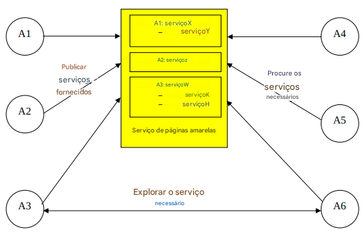

O serviço de páginas amarelas no JADE (de acordo com a especificação FIPA) é fornecido por um agente chamado DF (Directory Facilitator). Cada plataforma compatível com FIPA hospeda um agente DF padrão (cujo nome local é “`df`”). Outros agentes DF podem ser ativados e vários agentes DF (incluindo o padrão) podem ser federados para fornecer um único catálogo de páginas amarelas distribuído.


#### Interagindo com o DF

Sendo o DF um agente, é possível interagir com ele normalmente trocando mensagens   usando uma linguagem de conteúdo adequada (a linguagem SL0) e uma ontologia adequada (a ontologia de gerenciamento de agentes FIPA) de acordo com a especificação FIPA. Para simplificar essas interações, no entanto, o JADE fornece a classe `jade.domain.DFService` por meio da qual é possível publicar e pesquisar serviços por meio de chamadas de método.

1. **Serviços de publicação**

   - Um agente que deseja publicar um ou mais serviços deve fornecer ao DF uma descrição incluindo:
   
      **I) Descrição do Agente**: Seu AID; Lista de linguagens; Lista de Ontologias; Lista de serviços publicados
      
      **II) Descrição de cada serviço**: Tipo de serviço, Nome do serviço; Linguagens; Ontologias.
      
      **III) Propriedades especificas do serviço**
   
   - As classes `DFAgentDescription`, `ServiceDescription` e `Property`, incluídas no pacote `jade.domain.FIPAAgentManagement`, representam as três abstrações mencionadas.
   - Para publicar um serviço, um agente deve criar uma descrição adequada (como uma instância da classe `DFAgentDescription`) e chamar o método estático `register()` da classe `DFService`.
  
2. **Procurando por serviços**
     - Um agente que deseja procurar por serviços deve fornecer ao DF uma descrição de modelo. 
     - O resultado da pesquisa é a **lista de todas as descrições que correspondem ao modelo fornecido**. 
     - Uma descrição corresponde ao modelo se todos os campos especificados no modelo estiverem presentes na descrição com os mesmos valores.

---

## Ferramentas Gráficas

### Remote Monitoring Agent (RMA)

- Funciona como uma console gráfica para gerenciamento e controle da plataforma;
- É usada para monitorar e administrar o status de todos os componentes da plataforma distribuída, incluindo agentes e containers, e
- Serve para controlar o ciclo de vida dos agentes, conexões com plataformas remotas e a instalação de protocolos de transporte de mensagens.

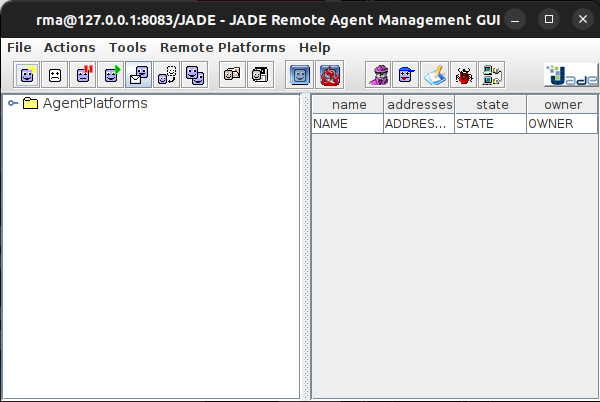
### Sniffer Agent

- É usado para interceptar as mensagens ACL () e exibir a conversação através de uma notação similar ao diagrama de seqüência da UML;
- Útil para depuração de conversação entre agentes, e
- Permite que as conversações sejam salvas ou carregadas em arquivos.
- **Ve as interações → depuração**

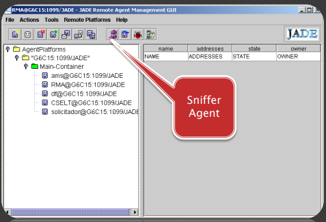
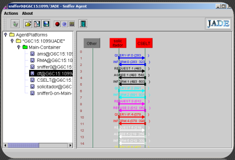

### Introspector Agent

- É usado para monitorar o **ciclo de vida** de um agente, suas mensagens ACL trocadas e seus comportamentos em execução, e
- Permite controlar a execução de um agente

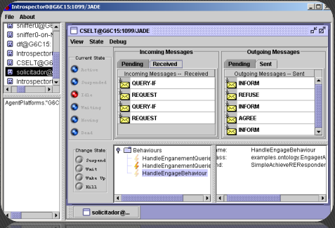

### Dummy Agent

- É uma ferramenta utilizada para compor e enviar mensagens ACL para outros agentes, bem como para exibir as mensagens recebidas, e
- Permite que as mensagens sejam salvas ou carregadas em arquivos.

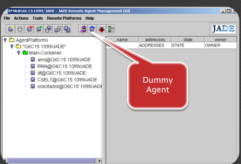
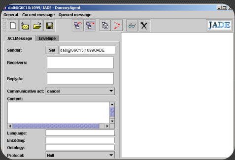

### Directory Facilitator (DF)

- Representa o FIPA DF, o componente de **páginas amarelas** do sistema;
- Permite registrar / de-registrar / modificar / buscar agentes e serviços, e
- Permite criar confederações de DF e realizar propagação de busca através de domínios e subdomínios.

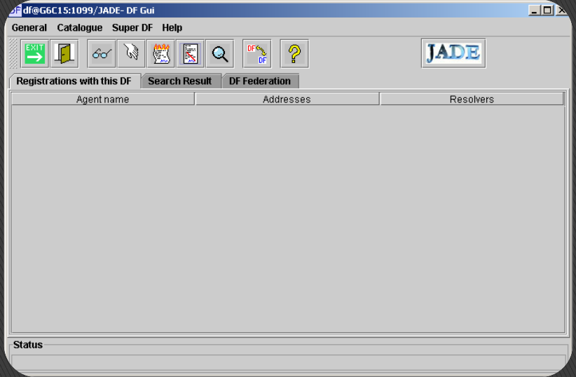

---

## Agentes

- Um agente em JADE é uma instância da classe Agent
- Heranças da classe agente:
    - Características para realizar as interações básicas com
    a plataforma de agentes (registro, configuração, gerenciamento
    remoto, ...), e
    - O conjunto básico de métodos
    que podem ser chamados para implementar o comportamento
    personalizado do agente (enviar/receber mensagens, usar protocolos de interação, ... )

- Cada serviço/funcionalidade de um agente deve ser
implementado como um ou mais comportamentos;
- Os comportamentos de JADE modelam arquiteturas reativas, e
- A abstração de comportamento do modelo do agente de JADE permite a integração de produtos de software externos para enriquecer a arquitetura do agente.
    - Ex: agentes reativosdeliberativos com JADEX e JESS agentes mais cognitivos...
- A classe Agent representa os estados do agente através de constantes:
    - AP_INITIATED - Objeto Agente instanciado, mas não registrado no AMS
    - AP_ACTIVE - Agente iniciado e registrado no AMS
    - AP_SUSPENDED - Agente, no momento, suspenso, parado
    - AP_WAITING - Agente em modo de espera, bloqueado
    - AP_DELETED - Agente definitivamente “morto” : (
    - AP_TRANSIT - Agente móvel migrando
    - AP_COPY - Agente sendo clonado
    - AP_GONE - Agente móvel migrado
    
    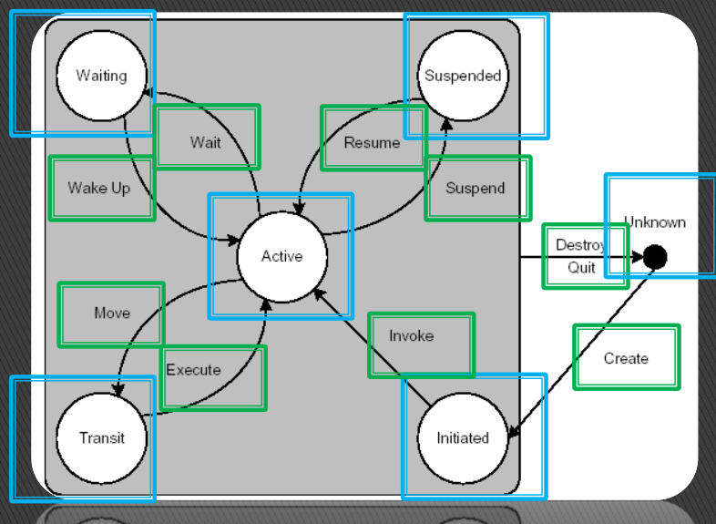
    
- Como JADE controla a criação de um novo agente?
    1. O construtor do agente é executado;
    2. Um AID (Agent Identifier) é atribuído ao agente;
        
        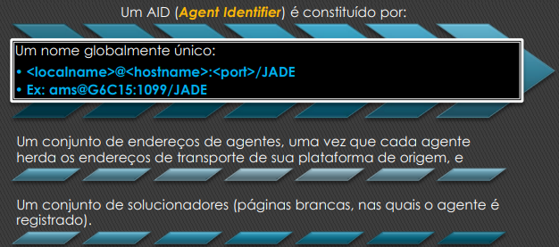
        
    3. O agente é registrado no AMS (Agent Management System) - páginas brancas;
    4. O agente é colocado no estado AP_ACTIVE;
    5. O método setup() é executado.
        1. Deve ser implementado para inicialização de um agente;
        2. Deve adicionar pelo menos um comportamento para o agente através do método addBehaviour();
        3. Ao final da execução do método setup(), JADE executa automaticamente os comportamentos, a partir do que foi primeiramente declarado.

### Definições do Agente

Criar um agente JADE é tão simples quanto definir uma classe estendendo a classe `jade.core.Agent` e
implementar o método `setup()` conforme mostrado no código abaixo.
```java
   import jade.core.Agent;
      public class BookBuyerAgent extends Agent {
         protected void setup() {
         // Imprima uma mensagem de boas-vindas
            System.out.println(“Olá! O agente comprador “+getAID().getName()+” está pronto.”);
         }
   }
```

O método `setup()` tem a intenção de incluir inicializações de agentes. O trabalho real que um agente tem que fazer é normalmente realizado dentro de “comportamentos”.

#### **Identificadores de agentes**

- Cada agente é identificado por um “identificador de agente” representado como uma instância da classe `jade.core.AID`.
- O método `getAID()` da classe `Agent` permite recuperar o identificador do agente. 
- Um objeto `AID` inclui um nome globalmente exclusivo mais um número de endereços. 
- O nome em JADE tem o formato `<nickname>@<platform-name>` para que um agente chamado Peter vivendo em uma plataforma chamada P1 tenha Peter@P1 como nome globalmente exclusivo. 
- Os endereços incluídos no AID são os endereços da plataforma em que o agente vive. Esses endereços são **usados ​​apenas quando um agente precisa se comunicar com outro agente vivendo em uma plataforma diferente**. 
- Os desenvolvedores precisam se importar com eles apenas em casos específicos que estão fora do escopo deste exemplo.
- Sabendo o apelido de um agente, seu AID pode ser obtido da seguinte forma:
```java
      String nickname = “Peter”;
      AID id = new AID(nickname, AID.ISLOCALNAME);
```
- A constante `ISLOCALNAME` indica que o primeiro parâmetro representa o apelido (local para a
plataforma) e não o nome globalmente exclusivo do agente.

#### **Executando agentes**

- O agente criado pode ser compilado da seguinte forma.
```java
javac –classpath <JADE-classes> BookBuyerAgent.java
```

- Para executar o agente compilado, o tempo de execução JADE deve ser iniciado e um apelido para o agente a ser executado deve ser escolhido:
```java
java –classpath <JADE-classes>;. jade.Boot buyer:BookBuyerAgent
```

*Mais detalhes sobre a compilação e execução de agentes podem ser encontrados no Tutorial Administrativo JADE ou no Guia do Administrador JADE disponível no site JADE. O resultado do comando digitado é o seguinte.*

- A primeira parte da saída abaixo é o aviso de isenção de responsabilidade do JADE que é impresso toda vez que o tempo de execução do JADE
é iniciado. 

      C:\jade>java –classpath <JADE-classes>;. jade.Boot buyer:BookBuyerAgent
      5-mag-2008 11.06.45 jade.core.Runtime beginContainer
      INFO: ----------------------------------
      This is JADE snapshot - revision 5995 of 2007/09/03 09:45:22
      downloaded in Open Source, under LGPL restrictions,
      at http://jade.tilab.com/
      ----------------------------------------
      5-mag-2008 11.06.51 jade.core.BaseService init
      8
      INFO: Service jade.core.management.AgentManagement initialized
      5-mag-2008 11.06.51 jade.core.BaseService init
      INFO: Service jade.core.messaging.Messaging initialized
      5-mag-2008 11.06.52 jade.core.BaseService init
      INFO: Service jade.core.mobility.AgentMobility initialized
      5-mag-2008 11.06.52 jade.core.BaseService init
      INFO: Service jade.core.event.Notification initialized
      5-mag-2008 11.06.52 jade.core.messaging.MessagingService clearCachedSlice
      INFO: Clearing cache
      5-mag-2008 11.06.53 jade.mtp.http.HTTPServer <init>
      INFO: HTTP-MTP Using XML parser com.sun.org.apache.xerces.internal.parsers.SAXParser
      5-mag-2008 11.06.54 jade.core.messaging.MessagingService boot
      INFO: MTP addresses:
      http://NBNT2004130496.telecomitalia.local:7778/acc
      5-mag-2008 11.06.54 jade.core.AgentContainerImpl joinPlatform
      INFO: --------------------------------------
      Agent container Main-Container@NBNT2004130496 is ready.
      --------------------------------------------
      Hello! Buyer-agent buyer@NBNT2004130496:1099/JADE is ready.
- Segue:
  - A indicação de que um contêiner chamado “Main-Container” está pronto conclui a inicialização do tempo de execução do JADE. 
  - Quando o tempo de execução do JADE termina, nosso
agente é iniciado e imprime sua mensagem de boas-vindas. 
  - O apelido do agente é “buyer” conforme especificamos na linha de comando. 
  - O nome da plataforma “NBNT2004130496:1099/JADE” é atribuído automaticamente com base no host e na porta em que você está executando o JADE. 

*Consulte o guia do administrador do JADE para atribuir um nome à plataforma.*

#### **Terminando agentes**
- Mesmo que não tenha mais nada para fazer após imprimir a mensagem de boas-vindas, nosso agente ainda está em execução. 
- Para fazê-lo terminar, seu método `doDelete()` deve ser chamado. 
- Similarmente ao método `setup()` que é invocado pelo tempo de execução JADE assim que um agente inicia e tem a intenção de incluir inicializações de agentes, o método `takeDown()` é invocado logo antes de um agente terminar e tem a intenção de incluir operações de limpeza de agentes.

#### Passando argumentos para um agente
- Os agentes podem obter argumentos de inicialização especificados na linha de comando. Esses argumentos podem ser recuperados, como uma matriz de `Object`, por meio do método `getArguments()` da classe `Agent`. 
- Conforme mencionado no, queremos que nosso `BookBuyerAgent` obtenha o título do livro a ser comprado como um argumento de linha de comando.
Para conseguir isso, nós o modificamos da seguinte forma:

```java
   import jade.core.Agent;
   import jade.core.AID;
   public class BookBuyerAgent extends Agent {
      // The title of the book to buy
      private String targetBookTitle;
      // The list of known seller agents
      private AID[] sellerAgents = {new AID(“seller1”, AID.ISLOCALNAME),
                                    new AID(“seller2”, AID.ISLOCALNAME)};
      // Put agent initializations here
      protected void setup() {
         // Printout a welcome message
         System.out.println(“Hello! Buyer-agent “+getAID().getName()+” is ready.”);

         // Get the title of the book to buy as a start-up argument
         Object[] args = getArguments();
         if (args != null && args.length > 0) {
            targetBookTitle = (String) args[0];
            System.out.println(“Trying to buy “+targetBookTitle);
         }
         else {
            // Make the agent terminate immediately
            System.out.println(“No book title specified“);
            doDelete();
         }
      }
      // Put agent clean-up operations here
      protected void takeDown() {
         // Printout a dismissal message
         System.out.println(“Buyer-agent “+getAID().getName()+” terminating.”);
      }
   }
```

Os argumentos na linha de comando são especificados entre parênteses e separados por espaços.

      C:\jade>java jade.Boot buyer:BookBuyerAgent(The-Lord-of-the-rings)
      ...
      ...
      5-mag-2008 11.11.00 jade.core.AgentContainerImpl joinPlatform
      INFO: --------------------------------------
      Agent container Main-Container@NBNT2004130496 is ready.
      --------------------------------------------
      Hello! Buyer-agent buyer@NBNT2004130496:1099/JADE is ready.
      Trying to buy The-Lord-of-the-Rings

---

## Comportamento dos agentes 

O trabalho real que um agente tem que fazer é tipicamente realizado dentro de “comportamentos”.

- Um comportamento representa uma tarefa que um agente pode realizar e é implementado como um objeto de uma classe que estende `jade.core.behaviours.Behaviour`. 
- Para fazer um agente executar a tarefa implementada por um objeto de comportamento, é suficiente adicionar o comportamento ao agente por meio do método `addBehaviour()` da classe `Agent`.
- Os comportamentos podem ser adicionados a qualquer momento: Quando um agente inicia (no método `setup()`) ou de dentro de outros comportamentos. 
- Cada classe que estende o comportamento deve implementar o método `action()`, que realmente define as operações a serem realizadas quando o comportamento está em execução e o método done() (retorna um valor booleano), que especifica se um comportamento foi concluído ou não e deve ser removido do conjunto de comportamentos que um agente está realizando.

#### Agendamento e execução de comportamentos

Um agente pode executar vários comportamentos simultaneamente. No entanto, é importante notar que o agendamento de comportamentos em um agente não é preventivo (como para threads Java), mas cooperativo. 
**Isso significa que quando um comportamento é agendado para execução, seu método action() é chamado e executado até retornar**.
Portanto, é o programador que define quando um agente alterna da execução de um comportamento para a execução do próximo. 

Embora exija um pequeno esforço adicional dos programadores, essa abordagem tem várias vantagens:
- Permite ter um único thread Java por agente (o que é muito importante, especialmente em ambientes com recursos limitados, como celulares).
- Oferece melhor desempenho, pois a troca de comportamento é extremamente mais rápida do que a troca de thread Java.
- Elimina todos os problemas de sincronização entre comportamentos simultâneos acessando os mesmos recursos (isso também acelera o desempenho), pois todos os comportamentos são executados pelo mesmo thread Java.
- Quando ocorre uma troca de comportamento, o status de um agente não inclui nenhuma informação de pilha e, portanto, é possível tirar um "instantâneo" dele. Isso torna possível implementar recursos avançados importantes, por exemplo, salvar o status de um agente em um armazenamento persistente para retomada posterior (agentpersistency) ou transferi-lo para outro contêiner para execução remota (agent mobility). Persistência e mobilidade são recursos JADE avançados, não tratados neste exemplo.

O caminho de execução do agente thread3 é descrito na Figura 1


Levando em consideração o mecanismo de agendamento descrito, é importante ressaltar que um comportamento como o relatado abaixo impede que qualquer outro comportamento seja executado, pois seu método action() nunca retorna.

```java
   public class OverbearingBehaviour extends Behaviour {
      public void action() {
         while (true) {
         // do something
         }
      }
      public boolean done() {
         return true;
      }
   }
```

Quando não há comportamentos disponíveis para execução, o thread do agente entra em hibernação para não consumir tempo de CPU. Ele é despertado assim que há novamente um comportamento disponível para execução.

#### Tipos de comportamentos
1. **One-shot**
   - Comportamentos concluídos imediatamente e cujo método action() é executado apenas uma vez. 
   - O jade.core.behaviours.OneShotBehaviour já implementa o método done() retornando true e pode ser convenientemente estendido para implementar comportamentos one-shot. 
   - public class MyOneShotBehaviour extends public void action() { // perform operation X }OneShotBehaviour {}
   - A operação X é realizada apenas uma vez.
      ```java
      public class MyOneShotBehaviour extends OneShotBehaviour {
         public void action() {
         // perform operation X
         }
      }
      ```
2. **Cíclicos**
   - Nunca são concluídos e cujo método action() executa as mesmas operações sempre que é chamado. 
   - O jade.core.behaviours.CyclicBehaviour já implementa o método done() retornando false e pode ser convenientemente estendido para implementar comportamentos cíclicos.
   - public class MyCyclicBehaviour extends public void action() { // executar a operação Y }CyclicBehaviour {}
   - A operação Y é executada repetidamente para sempre (até que o agente que executa o comportamento acima termine).
        ```java
         public class MyCyclicBehaviour extends CyclicBehaviour {
            public void action() {
            // perform operation Y
            }
         }
      ```
3. **Genéricos**
   - Incorporam um status e executam operações diferentes dependendo desse status. 
   - Eles são concluídos quando uma determinada condição é atendida.
   - public class MyThreeStepBehaviour extends private int step = 0; public void action() { switch case 0:(step) { // executar a operação X step++; break; case 1: // executar a operação Y step++; break; case 2: // executar a operação Z step++; break; }Behaviour { } public boolean done() { return step == 3;}}
   - As operações X, Y e Z são executadas uma após a outra e então o comportamento é concluído. 
   - O JADE fornece a possibilidade de combinar comportamentos simples para criar comportamentos complexos. 
   - No entanto, esse recurso está fora do escopo deste documento. Consulte o Javadoc do
      ```java
      public class MyThreeStepBehaviour extends Behaviour {
         private int step = 0;
         public void action() {
            switch (step) {
            case 0:
               // perform operation X
               step++;
               break;
            case 1:
               // perform operation Y
               step++;
               break;
            case 2:
               // perform operation Z
               step++;
               break;
            }
         }
         public boolean done() {
            return step == 3; 
         }
      }
      ```
   -  As operações X, Y e Z são executadas uma após a outra e então o comportamento é concluído.
   - *O JADE fornece a possibilidade de combinar comportamentos simples para criar comportamentos complexos. No entanto, esse recurso está fora do escopo deste documento. Consulte o Javadoc do `SequentialBehaviour`, `ParallelBehaviou`r e `FSMBehaviour` para obter detalhes.*

#### Agendando operações em determinados pontos no tempo
O JADE fornece duas classes prontas (no pacote jade.core.behaviours) por meio das quais
é possível implementar facilmente comportamentos que executam certas operações em determinados pontos no tempo.
1. WakerBehaviour 
   - Os métodos `action()` e `done()` já estão implementados de tal forma para executar o método abstrato `handleElapsedTimeout()` após um determinado tempo limite (especificado no construtor) expirar. Após a execução do método handleElapsedTimeout(), o comportamento é concluído.
   ``` Java
      public class MyAgent extends Agent {
         protected void setup() {
            System.out.println(“Adicionando comportamento waker”);
            addBehaviour(new WakerBehaviour(this, 10000) {
               protected void handleElapsedTimeout() {
               // executar a operação X
               }
            } );
         }
      }
   ```
   - A operação X é realizada 10 segundos após a impressão “Adicionando comportamento de waker” aparecer.
2. TickerBehaviour
   -  Os métodos `action()` e `done()` já estão implementados de tal forma para executar o método abstrato `onTick()` repetidamente, esperando um determinado período (especificado no construtor) após cada execução. 
   -  Um `TickerBehaviour` nunca é concluído.
   ``` Java
      public class MyAgent extends Agent {
         protected void setup() {
         addBehaviour(new TickerBehaviour(this, 10000) {
            protected void onTick() {
            // executar a operação Y
            }
         } );
         }
      }
   ```         
   - A operação Y é realizada periodicamente a cada 10 segundos.

---

## Comunicação dos Agentes


Em JADE, os agentes comunicam-se através de passagem assíncrona de mensagens ACL;

- A classe ACLMessage representa as mensagens de acordo com as especificações da FIPA (fipa000061);
- Todos os parâmetros são pares **palavra-chave: valor**
- Os valores dos parâmetros podem ser inseridos através dos métodos **set()** e podem ser lidos através de métodos **get()**, e
- As performativas da FIPA são identificadas por constantes.
- **Subsistema de comunicação de JADE**
    - Todo agente tem uma fila privada de mensagens ACL criada e preenchida pelo
    subsistema de comunicação de JADE;
    - Foi projetado como um camaleão para alcançar um menor custo de passagem
    de mensagens, e
    - Se uma mensagem é enviada e o subsistema não consegue encontrar o destinatário, ele a envia para ser gerenciada pelo AMS.

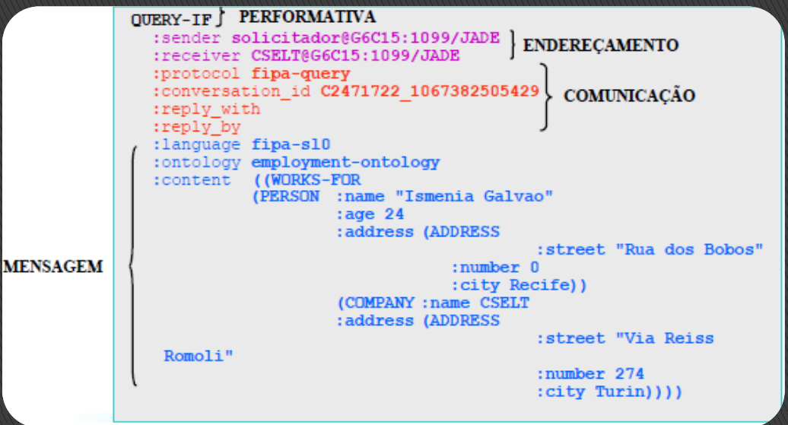

Um dos recursos mais importantes que os agentes JADE fornecem é a **capacidade de se comunicar**.
O paradigma de comunicação adotado é a **passagem de mensagens assíncronas**.


Cada agente tem uma espécie de caixa de correio (a fila de mensagens do agente) onde o tempo de execução JADE posta mensagens enviadas por outros agentes. 
Sempre que uma mensagem é postada na fila de mensagens, o agente receptor é notificado. 
Se e quando o agente realmente pega a mensagem da fila de mensagens para processar, isso depende completamente do programador.

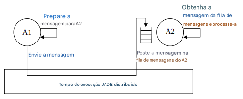

### A linguagem ACL

As mensagens trocadas pelos agentes JADE têm um formato especificado pela linguagem ACL definida pelo padrão internacional FIPA (http://www.fipa.org) para interoperabilidade de agentes. Este formato compreende um número de campos e em particular:
   - O **remetente** da mensagem
   - A lista de **destinatários**
   - A **intenção comunicativa** (também chamada de “performative”) indicando o que o remetente pretende alcançar ao enviar a mensagem. podendo ser:
     - `REQUEST`, se o remetente quiser que o destinatário realize uma ação
     - `INFORM`, se o remetente quiser que o destinatário esteja ciente de um fato
     - `QUERY_IF`, se o remetente quiser saber se uma determinada condição se mantém ou não
     - `CFP` (chamada para proposta), `PROPOSE`, `ACCEPT_PROPOSAL`, `REJECT_PROPOSAL`, se o remetente e o destinatário estiverem envolvidos em uma negociação, e mais.
 - O **conteúdo**, ou seja, as informações reais incluídas na mensagem (ou seja, a ação a ser realizada em uma mensagem REQUEST, o fato que o remetente deseja divulgar em uma mensagem INFORM …).
 - A **linguagem** de conteúdo, ou seja, a sintaxe usada para expressar o conteúdo (tanto o remetente quanto o destinatário devem ser capazes de codificar/analisar expressões compatíveis com essa sintaxe para que a comunicação seja eficaz).
 - A **ontologia**, ou seja, o vocabulário dos símbolos usados ​​no conteúdo e seu significado (tanto o remetente quanto o destinatário devem atribuir o mesmo significado aos símbolos para que a comunicação seja eficaz).
 - Alguns campos usados ​​para controlar várias conversas simultâneas e especificar tempos limite para receber uma resposta, como **conversation-id, reply-with, in-reply-to, reply-by**.

Uma mensagem no JADE é implementada como um objeto da classe `jade.lang.acl.ACLMessage` que fornece métodos get e set para manipular todos os campos de uma mensagem.

Para enviar uma mensagem basta preencher os campos de um objeto `ACLMessage` e então chamar o método `send()` da classe `Agent`. 
O código abaixo informa um agente cujo apelido é Peter que hoje está chovendo.
   ```
      ACLMessage msg = new ACLMessage(ACLMessage.INFORM);
      msg.addReceiver(new AID(“Peter”, AID.ISLOCALNAME));
      msg.setLanguage(“English”);
      msg.setOntology(“Weather-forecast-ontology”);
      msg.setContent(“Today it’s raining”);
      send(msg);
   ```

#### Recebendo mensagens

Conforme mencionado acima, o tempo de execução JADE posta automaticamente mensagens na fila de mensagens privadas do receptor assim que elas chegam. Um agente pode pegar mensagens de sua fila de mensagens por meio do método receive(). Este método retorna a primeira mensagem na fila de mensagens (removendo-a) ou nulo se a fila de mensagens estiver vazia e retorna imediatamente.
   ``` Java
      ACLMessage msg = receive();
      if (msg != null) {
         // Processa a mensagem
      }
   ```

#### Bloqueando um comportamento aguardando uma mensagem

Muitas vezes, os programadores precisam implementar comportamentos que processem mensagens recebidas por outros agentes. Este é o caso dos comportamentos `OfferRequestsServe`r e `PurchaseOrdersServer`, onde **precisamos atender mensagens de agentes compradores que carregam solicitações de oferta e ordens de compra**.

Tal comportamento deve estar em execução contínua (cíclicos) e, a cada execução de seu método `action()`, deve verificar se uma mensagem foi recebida e processá-la. Os dois comportamentos são muito semelhantes.

Aqui apresentamos o comportamento `OfferRequestsServer`. Veja as fontes disponíveis entre os exemplos JADE
para o código do PurchaseOrdersServer.
   ``` Java
      /**
         Classe interna OfferRequestsServer.
         Este é o comportamento usado por agentes Book-seller para atender solicitações de entrada
         para oferta de agentes compradores.
         Se o livro solicitado estiver no catálogo local, o agente vendedor responde
         com uma mensagem PROPOSE especificando o preço. Caso contrário, uma mensagem REFUSE é
         enviada de volta.
      */
      private class OfferRequestsServer extends CyclicBehaviour {
         public void action() {
         ACLMessage msg = myAgent.receive();
            if (msg != null) {
               // Mensagem recebida. Processe-a
               String title = msg.getContent();
               ACLMessage reply = msg.createReply();
               Integer price = (Integer) catalogue.get(title);
               if (price != null) {
                  // O livro solicitado está disponível para venda. Responda com o preço
                  reply.setPerformative(ACLMessage.PROPOSE);
                  reply.setContent(String.valueOf(price.intValue()));
               }
               else {
                  // O livro solicitado NÃO está disponível para venda.
                  reply.setPerformative(ACLMessage.REFUSE);
                  reply.setContent(“not-available”);
               }
               myAgent.send(reply);
            }
         }
      } // Fim da classe interna OfferRequestsServer
   ```
   - O comportamento `OfferRequestsServer` foi implementado como uma classe interna da classe `BookSellerAgent`. Isso simplifica as coisas, pois podemos acessar diretamente o catálogo de livros para venda; no entanto, não é obrigatório.
   - O método `createReply()` da classe `ACLMessage` cria automaticamente uma nova ACLMessage definindo corretamente os receptores e todos os campos usados ​​para controlar a conversa (conversation-id, reply-with, in-reply-to), se houver. 
   - Se olharmos para a Figura 1, no entanto, podemos notar que, quando adicionamos o comportamento acima, o thread do agente inicia um loop contínuo que consome muito CPU. Para evitar isso, gostaríamos de executar o método `action()` do comportamento OfferRequestsServer somente quando uma nova mensagem for recebida. Para fazer isso, podemos usar o método `block()` da classe Behaviour. Este método marca o comportamento como “bloqueado” para que o agente não o agende mais para execução. Quando uma nova mensagem é inserida na fila de mensagens do agente, todos os comportamentos bloqueados ficam disponíveis para execução novamente para que eles tenham a chance de processar a mensagem recebida. O método action() deve, portanto, ser
modificado da seguinte forma.
   ``` Java
      public void action() {
         ACLMessage msg = myAgent.receive();
            if (msg != null) {
               // Mensagem recebida. Processe-a
               ...
            }
            else {
               block();
            }
      }
   ```      
    - **O código acima é o padrão típico (e fortemente sugerido) para receber mensagens dentro de um comportamento.**

#### Selecionando mensagens com características dadas da fila de mensagens

- Considerando que os comportamentos `OfferRequestsServer` e PurchaseOrdersServer são
comportamentos cíclicos cujo método `action()` começa com uma chamada para `myAgent.receive()`, você pode ter percebido um problema: como podemos ter certeza de que o comportamento OfferRequestsServer pega da fila de mensagens do agente apenas mensagens que carregam solicitações de oferta e o comportamento PurchaseOrdersServer
apenas mensagens que carregam ordens de compra? 
- Para resolver esse problema, precisamos modificar o código que apresentamos até agora especificando “templates” apropriados quando chamamos o método `receive()`.
- Quando um template é especificado, o método `receive()` retorna a primeira mensagem (se houver) que corresponde a ele, enquanto ignora todas as mensagens não correspondentes. Esses templates são implementados como instâncias da classe j`ade.lang.acl.MessageTemplate` que fornece vários métodos de fábrica para criar templates de uma forma muito simples e flexível.
- Usamos o performativo `CFP` para mensagens que transportam solicitações de oferta e o performativo `ACCEPT_PROPOSAL` para mensagens que transportam aceitações de propostas, ou seja, ordens de compra.
- Portanto, modificamos o método `action()` do `OfferRequestsServer` para que a chamada para
`myAgent.receive()` ignore todas as mensagens, exceto aquelas cujo performativo é `CFP`.
   ```
      public void action() {
         MessageTemplate mt = MessageTemplate.MatchPerformative(ACLMessage.CFP);
         ACLMessage msg = myAgent.receive(mt);
            if (msg != null) {
               // Mensagem CFP recebida. Processe-a
               ...
            }
            else {
               block();
            }
      }
   ```

#### Conversas complexas
   - O comportamento `RequestPerformer` representa um exemplo de um comportamento que realiza uma conversa “complexa”. 
   - Uma conversa é uma sequência de mensagens trocadas por dois ou mais agentes com relações causais e temporais bem definidas. 
   - O comportamento `RequestPerformer` tem que enviar uma mensagem `CFP` para vários agentes (os agentes vendedores conhecidos), obter todas as respostas e, caso pelo menos uma resposta `PROPOSE` seja recebida, enviar uma mensagem `ACCEPT_PROPOSAL` adicional (para o agente vendedor que fez a proposta) e obter a resposta. 
   - Sempre que uma conversa tiver que ser realizada, é uma boa prática especificar os campos de controle de conversação nas mensagens trocadas dentro da conversa. Isso permite criar facilmente e sem ambiguidade modelos que correspondam às possíveis respostas.
  - Conversas complexas são normalmente realizadas seguindo um protocolo de interação bem definido. O JADE fornece um suporte rico para implementar conversas seguindo protocolos de interação no pacote `jade.proto`. 
  - Em particular, a conversa que implementamos segue um protocolo “Contract-net” e poderia ter sido facilmente implementada explorando a classe `jade.proto.ContractNetInitiator`. 

#### Recebendo mensagens no modo de bloqueio

   - Além do método `receive()`, a classe `Agent` também fornece o método `blockingReceive()` que, como o nome sugere, é uma chamada de bloqueio: ele não retorna até que haja uma mensagem na fila de mensagens do agente. 
   - A versão sobrecarregada que toma um `MessageTemplate` como parâmetro (ele não retorna até que haja uma mensagem que corresponda ao modelo especificado) também está disponível.
   - É importante enfatizar que os métodos `blockingReceive()` realmente bloqueiam o thread do agente.
   - Portanto, se você chamar `blockingReceive()` de dentro de um comportamento, isso impede que todos os outros comportamentos sejam executados até que a chamada para `blockingReceive()` retorne. 
   - Levando em conta a consideração acima, uma boa prática de programação para receber mensagens é: 
     - usar `blockingReceive()` nos métodos `setup()` e `takeDown()`; 
     - usar `receive()` em combinação com `Behaviour.block()` dentro de comportamentos.

---

## Referência
- https://jade.tilab.com/doc/tutorials/JADEProgramming-Tutorial-for-beginners.pdf