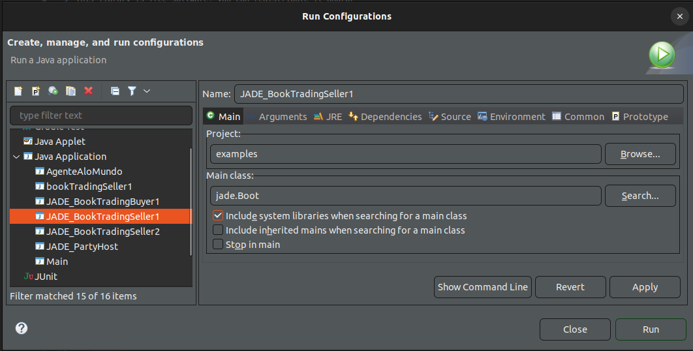

# BookTrading
## Introdução 
O exemplo BookTrading (Negociação de livros) apresenta um sistema multiagente muito simples para negociação de livros on-line. Onde apresenta alguns agentes vendendo livros e outros agentes comprando livros em nome de seus usuários.

#### **Comprador**

   - Cada agente comprador recebe o título do livro para comprar (o “livro alvo”) como um argumento de linha de comando
   - Periodicamente solicita que todos os agentes vendedores conhecidos forneçam uma oferta, ao consultar as páginas amarelas (df).
   - Assim que uma oferta é recebida, o agente comprador a aceita e emite uma ordem de compra. 
   - Se mais de um agente vendedor fornecer uma oferta, o agente
comprador aceita a melhor (menor preço).
   - Tendo comprado o livro alvo, o agente comprador encerra.

#### **Vendedor**

   - Cada agente vendedor tem uma GUI mínima por meio da qual o usuário pode inserir novos títulos (e o preço associado) no catálogo local de livros para venda. 
   - Os agentes vendedores esperam continuamente por solicitações de agentes compradores.
   - Quando solicitados a fornecer uma oferta para um livro, eles verificam se o livro solicitado está em seu catálogo e, neste caso, respondem com o preço. Caso contrário, eles se recusam.
   - Quando recebem uma ordem de compra eles a atendem e removem o livro solicitado do catálogo.

*Autor: Giovanni Caire (TILab) - Data: 12/03/2003*

---

## Agentes

#### **Identificadores de agentes**

- Cada agente é identificado por um “identificador de agente” representado como uma instância da classe `jade.core.AID`.
- O método `getAID()` da classe `Agent` permite recuperar o identificador do agente. 
- Um objeto `AID` inclui um nome globalmente exclusivo mais um número de endereços. 
- O nome em JADE tem o formato `<nickname>@<platform-name>` para que um agente chamado Peter vivendo em uma plataforma chamada P1 tenha Peter@P1 como nome globalmente exclusivo. 
- Os endereços incluídos no AID são os endereços da plataforma em que o agente vive. Esses endereços são **usados ​​apenas quando um agente precisa se comunicar com outro agente vivendo em uma plataforma diferente**. 
- Os desenvolvedores precisam se importar com eles apenas em casos específicos que estão fora do escopo deste exemplo.
- Sabendo o apelido de um agente, seu AID pode ser obtido da seguinte forma:
```java
      String nickname = “Peter”;
      AID id = new AID(nickname, AID.ISLOCALNAME);
```
- A constante `ISLOCALNAME` indica que o primeiro parâmetro representa o apelido (local para a
plataforma) e não o nome globalmente exclusivo do agente.

#### Passando argumentos para um agente
- Os agentes podem obter argumentos de inicialização especificados na linha de comando. Esses argumentos podem ser recuperados, como uma matriz de `Object`, por meio do método `getArguments()` da classe `Agent`. 
- Queremos que nosso `BookBuyerAgent` obtenha o título do livro a ser comprado como um argumento de linha de comando.
- Para conseguir isso, foi modificamos da seguinte forma:

```java
   import jade.core.Agent;
   import jade.core.AID;
   public class BookBuyerAgent extends Agent {
      // The title of the book to buy
      private String targetBookTitle;
      // The list of known seller agents
      private AID[] sellerAgents = {new AID(“seller1”, AID.ISLOCALNAME),
                                    new AID(“seller2”, AID.ISLOCALNAME)};
      // Put agent initializations here
      protected void setup() {
         // Printout a welcome message
         System.out.println(“Hello! Buyer-agent “+getAID().getName()+” is ready.”);

         // Get the title of the book to buy as a start-up argument
         Object[] args = getArguments();
         if (args != null && args.length > 0) {
            targetBookTitle = (String) args[0];
            System.out.println(“Trying to buy “+targetBookTitle);
         }
         else {
            // Make the agent terminate immediately
            System.out.println(“No book title specified“);
            doDelete();
         }
      }
      // Put agent clean-up operations here
      protected void takeDown() {
         // Printout a dismissal message
         System.out.println(“Buyer-agent “+getAID().getName()+” terminating.”);
      }
   }
```

Os argumentos na linha de comando são especificados entre parênteses e separados por espaços.

      C:\jade>java jade.Boot buyer:BookBuyerAgent(The-Lord-of-the-rings)
      ...
      ...
      5-mag-2008 11.11.00 jade.core.AgentContainerImpl joinPlatform
      INFO: --------------------------------------
      Agent container Main-Container@NBNT2004130496 is ready.
      --------------------------------------------
      Hello! Buyer-agent buyer@NBNT2004130496:1099/JADE is ready.
      Trying to buy The-Lord-of-the-Rings


---

## Comportamentos dos Agentes


Tendo descrito os tipos básicos de comportamento [JADE-Framework](../estudos/4-jade-framework.md), vamos agora analisar quais comportamentos devem ser realizados pelo agente **comprador de livros** e pelo **agente vendedor** de livros do nosso exemplo de negociação de livros.

##### 1. `BookBuyerAgent` (Comprador)

- Um agente comprador de livros solicita periodicamente aos agentes vendedores o livro que foi instruído a comprar. 
- Usando um `TickerBehaviour` que, em cada tique, adiciona outro comportamento que realmente lida com a solicitação aos agentes vendedores.
- Aqui está como o método `setup()` da nossa classe `BookBuyerAgent` pode ser modificado:
   ``` Java
      protected void setup() {
      // Imprima uma mensagem de boas-vindas
         System.out.println(“Olá! O agente comprador “+getAID().getName()+” está pronto.”);

         // Obtenha o título do livro para comprar como um argumento de inicialização
         Object[] args = getArguments();
         if (args != null && args.length > 0) {
            targetBookTitle = (String) args[0];
            System.out.println(“Tentando comprar “+targetBookTitle);
            // Adicione um TickerBehaviour que agende uma solicitação para agentes vendedores a cada minuto
            addBehaviour(new TickerBehaviour(this, 60000) {
               protected void onTick() {
               myAgent.addBehaviour(new RequestPerformer());
               }
            } );
         }
         else {
            // Faça o agente terminar
            System.out.println(“Nenhum título de livro alvo especificado“);
            doDelete();
         }
      }
   ```
  - O uso da variável protegida `myAgent`: cada comportamento tem um ponteiro para o agente que está executando-o.

##### 2. `BookSellerAgent` (Vendedor)

- Cada agente vendedor de livros aguarda solicitações de agentes compradores e as atende.
- Essas solicitações podem ser solicitações para fornecer uma oferta para um livro ou ordens de compra. 
- Um possível design para alcançar isso é fazer um agente vendedor de livros executar dois comportamentos cíclicos: 
  1. **Dedicado a atender solicitações de oferta**
  2. **Dedicado a atender ordens de compra**
- Além disso, precisamos fazer o agente vendedor de livros executar um comportamento único **atualizando o catálogo de livros** disponíveis para venda sempre que o usuário adicionar um novo livro da GUI. 
- Aqui está como a classe BookSellerAgent pode ser implementada:
   ``` Java
      import jade.core.Agent;
      import jade.core.behaviours.*;
      import java.util.*;
      public class BookSellerAgent extends Agent {
         // The catalogue of books for sale (maps the title of a book to its price)
         private Hashtable catalogue;
         // The GUI by means of which the user can add books in the catalogue
         private BookSellerGui myGui;
         // Put agent initializations here
         protected void setup() {
            // Create the catalogue
            catalogue = new Hashtable();
            // Create and show the GUI
            myGui = new BookSellerGui(this);
            myGui.show();
            // Add the behaviour serving requests for offer from buyer agents
            addBehaviour(new OfferRequestsServer());
            // Add the behaviour serving purchase orders from buyer agents
            addBehaviour(new PurchaseOrdersServer());
         }
         // Put agent clean-up operations here
         protected void takeDown() {
            // Close the GUI
            myGui.dispose();
            // Printout a dismissal message
            System.out.println(“Seller-agent “+getAID().getName()+” terminating.”);
         }
         /**
         This is invoked by the GUI when the user adds a new book for sale
         */
         public void updateCatalogue(final String title, final int price) {
            addBehaviour(new OneShotBehaviour() {
               public void action() {
                  catalogue.put(title, new Integer(price));
               }
            } );
         }
      }
   ```

##### 3. `BookSellerGui` (Interface Vendedor)

---

## Comunicação dos Agentes

- No exemplo o performativo `CFP` (call for proposal) é usado para para mensagens que os agentes compradores enviam aos agentes vendedores para solicitar uma oferta para um livro. 
- O `PROPOSE` pode ser usado para mensagens que carregam ofertas do vendedor, e o `ACCEPT_PROPOSAL` para mensagens que carregam aceitação de oferta, ou seja, ordens de compra. 
- Finalmente, o `REFUSE` será usado para mensagens enviadas por agentes do vendedor quando o livro solicitado não estiver em seu catálogo.
- Em ambos tipos de mensagens enviadas por agentes do comprador, assumimos que o conteúdo da mensagem é o título do livro. O conteúdo das mensagens `PROPOSE` será o preço do livro.
- Como exemplo, aqui está como uma mensagem `CFP` pode ser criada e enviada:
   ```
      // Mensagem que carrega uma solicitação de oferta
      ACLMessage cfp = new ACLMessage(ACLMessage.CFP);
      for (int i = 0; i < sellerAgents.lenght; ++i) {
      cfp.addReceiver(sellerAgents[i]);
      }
      cfp.setContent(targetBookTitle);
      myAgent.send(cfp);
   ```

---

## 5. `DFService` - Páginas Amarelas
Assumimos que há um conjunto fixo de agentes vendedores (seller1 e seller2) e que cada agente comprador já os conhece (veja a variável membro AID[] sellerAgents da classe BookBuyerAgent no código passando argumentos). 

Veremos como nos livrar dessa suposição e explorar o serviço das [páginas amarelas](../estudos/4-jade-framework.md) fornecido pela plataforma JADE para fazer com que os agentes compradores descubram dinamicamente os agentes vendedores disponíveis em um determinado momento.

#### 1. Publicando serviço
   
   - As classes `DFAgentDescription`, `ServiceDescription` e `Property`, incluídas no pacote `jade.domain.FIPAAgentManagement`, representam as três abstrações mencionadas.
   - Para publicar um serviço, um agente deve criar uma descrição adequada (como uma instância da classe `DFAgentDescription`) e chamar o método estático `register()` da classe `DFService`.
   - Normalmente, mas não necessariamente, o registro do serviço (publicação) é feito no método `setup()` conforme mostrado abaixo no caso do agente `BookSeller`.
   ``` Java
      protected void setup() {
         ...
         // Register the book-selling service in the yellow pages
         DFAgentDescription dfd = new DFAgentDescription();
         dfd.setName(getAID());
         ServiceDescription sd = new ServiceDescription();
         sd.setType(“book-selling”);
         sd.setName(“JADE-book-trading”);
         dfd.addServices(sd);
         try {
            DFService.register(this, dfd);
         }
         catch (FIPAException fe) {
            fe.printStackTrace();
         }
         ...
      }
   ``` 
   - Observe que neste exemplo simples não especificamos nenhuma linguagem, ontologia ou propriedade específica do serviço. Quando um agente encerra, é uma boa prática cancelar o registro de serviços publicados.
   ``` Java
      protected void takeDown() {
         // Deregister from the yellow pages
         try {
            DFService.deregister(this);
         }
         catch (FIPAException fe) {
            fe.printStackTrace();
         }
         // Close the GUI
         myGui.dispose();
         // Printout a dismissal message
         System.out.println(“Seller-agent “+getAID().getName()+” terminating.”);
      }
   ``` 

#### 2. Procurando serviço

- Um agente que deseja procurar por serviços deve fornecer ao DF uma descrição de modelo. 
- O resultado da pesquisa é a **lista de todas as descrições que correspondem ao modelo fornecido**. 
- Uma descrição corresponde ao modelo se todos os campos especificados no modelo estiverem presentes na descrição com os mesmos valores.
 - O método estático `search()` da classe DFService pode ser usado conforme exemplificado no código usado pelo agente comprador de livros para encontrar dinamicamente todos os agentes que fornecem um serviço do tipo “venda de livros”.
 ``` Java
    public class BookBuyerAgent extends Agent {
       // The title of the book to buy
       private String targetBookTitle;
       // The list of known seller agents
       private AID[] sellerAgents;
       // Put agent initializations here
       protected void setup() {
          // Printout a welcome message
          System.out.println(“Hello! Buyer-agent “+getAID().getName()+” is ready.”);

          // Get the title of the book to buy as a start-up argument
          Object[] args = getArguments();
          if (args != null && args.length > 0) {
             targetBookTitle = (String) args[0];
             System.out.println(“Trying to buy “+targetBookTitle);
             // Add a TickerBehaviour that schedules a request to seller agents every minute
             addBehaviour(new TickerBehaviour(this, 60000) {
                protected void onTick() {
                   // Update the list of seller agents
                   DFAgentDescription template = new DFAgentDescription();
                   ServiceDescription sd = new ServiceDescription();
                   sd.setType(“book-selling”);
                   template.addServices(sd);
                   try {
                      DFAgentDescription[] result = DFService.search(myAgent, template);
                      sellerAgents = new AID[result.length];
                      for (int i = 0; i < result.length; ++i) {
                      sellerAgents[i] = result[i].getName();
                   }
                   }
                   catch (FIPAException fe) {
                      fe.printStackTrace();
                   }
                   // Perform the request
                   myAgent.addBehaviour(new RequestPerformer());
                }
             } );
             ...
          }
       }
    }
 ```

    - Observe que a atualização da lista de agentes vendedores conhecidos é feita antes de cada tentativa de comprar o livro-alvo já que os agentes vendedores podem aparecer e desaparecer dinamicamente no sistema. A classe `DFService` também fornece suporte para assinar o DF para ser notificado assim que um agente publicar um determinado serviço (consulte os métodos `searchUntilFound()` e `createSubscriptionMessage()`), mas isso está fora do escopo deste tutorial.

---

## Rodando o código - ECLIPSE
Passos no Eclipse - Run configuration
1. Criar o primeiro agente com o comando para abrir a interface do prório jade (gui)
   - Name: `JADE_BookTradingSeller1`
   - Project: `<Nome do projeto>`
   - Arguments: `-gui -local-host 127.0.0.1 -local-port 1099 seller1:BookS1ellerAgent`
      
      
   - Cadastrar o nome do livro e preço
      
1. Cria um ou mais agentes para ter concorrência
   - Name: `JADE_BookTradingSeller2`
   - Project: `<Nome do projeto>`
   - Arguments: `-container seller2:BookSellerAgent` 
   - Cadastrar o nome do livro e preço
      
2. Tentar fazer uma comprar como comprador
   - Name: `JADE_BookTradingBuyer1`
   - Project: `<Nome do projeto>`
   - Arguments: `-container buyer1:BookBuyerAgent(SenhorDosAneis)` 
   - A classe foi criada para passar o nome do livro
      

---

## Referência
- https://jade.tilab.com/doc/tutorials/JADEProgramming-Tutorial-for-beginners.pdf