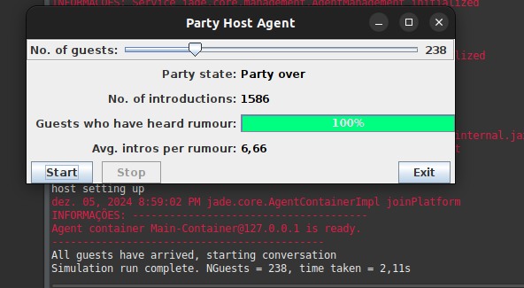

# Party

Este exemplo mostra um sistema multiagente simples onde um **host** define uma festa para a qual vários agentes são convidados. Este também é um teste de estresse para a plataforma, pois o número de agentes, mensagens e conversas de agentes é muito alto.

*Autor: Ian Dickinson, HP Labs ( e-mail ) - Data: 12/10/2001*

---

## Agentes
#### Agente de Host

- **Descrição:** Agente que representa o anfitrião de uma festa, para a qual um número de convidados controlado pelo usuário é convidado.
- **Observação:** Para iniciar o agente anfitrião, ele deve ser chamado de 'host': `java jade.Boot -gui host:examples.party.HostAgent()`
- **Source:** `\src\exemplos\parte\HostAgent.java`

#### Agente de Convidados

- **Descrição:** Agente que representa o convidado em uma festa.
- **Source:** `\src\exemplos\festa\GuestAgent.java`

---

## Execução
1. O usuário seleciona um número de convidados para participar da festa de 0 a 1000, usando o controle deslizante na IU.
2. Quando a festa começa, o anfitrião cria N agentes convidados, cada um dos quais se registra no DF, e envia ao anfitrião uma mensagem para dizer que chegaram. Quando todos os convidados chegam, a festa começa. O anfitrião seleciona um convidado aleatoriamente e conta a ele um boato. O anfitrião então seleciona dois outros convidados aleatoriamente e os apresenta um ao outro.
3. A festa então prossegue da seguinte forma:
   - Cada convidado que é apresentado a alguém pede ao anfitrião para apresentá-lo a outro convidado (aleatoriamente).
   - Se um convidado tem alguém se apresentando, e o convidado sabe do boato, ele conta ao outro convidado.
   - Quando um convidado ouve o boato pela primeira vez, ele notifica o anfitrião.
   - Quando todos os convidados ouvem o boato, a festa termina e os convidados vão embora.

