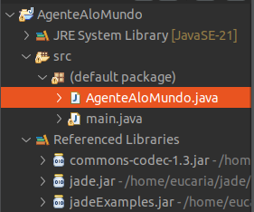
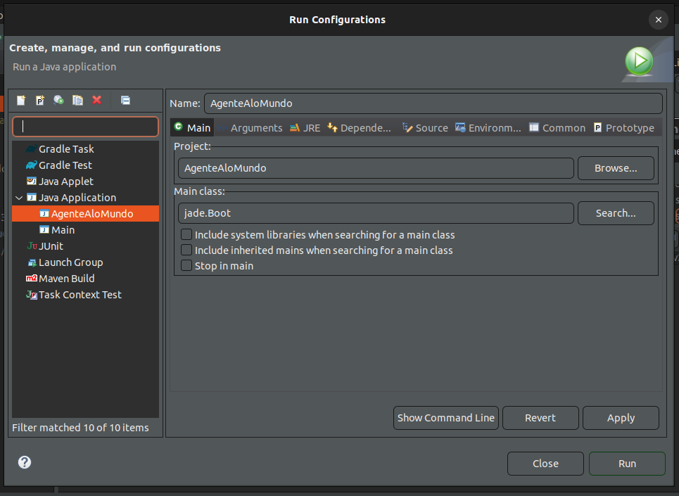
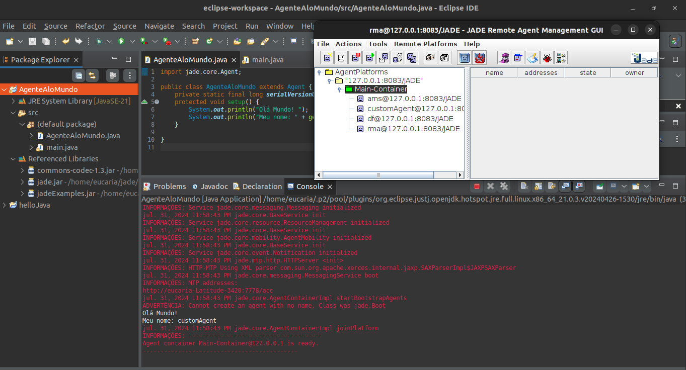

# Instalação JADE - Ubuntu

<!-- ### Java

Testei várias versões mas a que deu certo foi a do **JDK 11**

Obs: testar novamente com a 17 e demais e em outro SO -->
  
### JADE

Arquivos de instalação no [site](https://jade.tilab.com/download/jade/?page_id=790).

- Baixar e descompactar na pasta pessoal → /home/usuario/jade
- Descompactar os arquivos usando o comando `jar xvf`  para evitar incompatibilidades.

### Variáveis de ambiente

- Para alterar:  `sudo nano ~/.bashrc`

```bash
# JADE
export JADE_LIB=/home/usuario/jade/lib
export JADE_CP=$JADE_LIB/jade.jar:$JADE_LIB/jadeExamples.jar:$JADE_LIB/commons->
alias rJade='java -cp $JADE_CP jade.Boot -gui'
alias cJade='javac -cp $JADE_CP'
```

- Salvar: `source ~/.bashrc` e `reboot`

### Teste

No terminal execute o comando `rJade`.


## OlaMundo
- Crie um projeto java `AgenteAloMundo`
- Crie a classe `AgenteAloMundo` que extende da classe agente do jade.

    

    ```java
    import jade.core.Agent;

    public class AgenteAloMundo extends Agent {
        private static final long serialVersionUID = 1L;
        protected void setup() {
            System.out.println("Olá Mundo! ");
            System.out.println("Meu nome: " + getLocalName());
        }
    }
    ```

### Adicionar bibliotecas externas (jade)

- Clique no projeto com o botão direiro
- Clique em `Build Path`
- Clique em `Add External Archives`
    
- E selecione os arquivos .jar: `jade.jar`, `jadeExemples.jar` e `commons-codec-1.3.jar`

### Run Configuration


- Crie uma `Java Aplication`
  - **Name:** `AgenteAloMundo` -> pode ser outro nome que desejar
  - **Project:** `AgenteAloMundo` 
  - **Main class:** `jade.Boot`

  
- Defina os argumentos a serem passados na aba `Arguments`
    ```java
    -gui -local-host 127.0.0.1 -local-port 8083 customAgent:AgenteAloMundo
    ```
  - `-gui`: para abrir a interface gráfica do jade
  - `-local-host`: é preciso definir o localhost
  - `-loal-port`: é preciso definir uma porta
  - `customAgent`: nome a desejar do agente que será executado/criado
  - `AgenteAloMundo`: classe do agente
- Clique em: Apply → Run

### Resultado esperado

