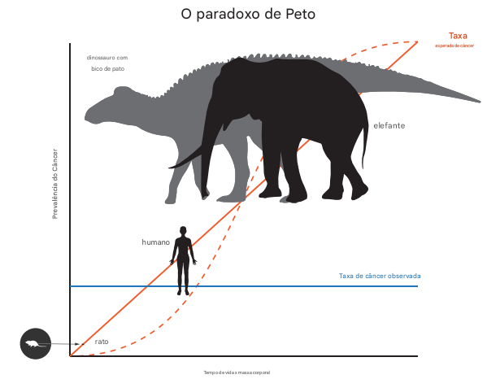

# Tema - Paradoxo de Peto

<iframe 
    width="560" 
    height="315" 
    src="https://www.youtube.com/embed/3gB2qq88viI" 
    title="YouTube video player" 
    frameborder="0" 
    allow="accelerometer; autoplay; clipboard-write; encrypted-media; gyroscope; picture-in-picture" 
    allowfullscreen>
</iframe>

- O risco de desenvolver câncer deve teoricamente aumentar com o número de células e a vida útil de um organismo. 
- No entanto, animais gigantescos não têm mais câncer do que humanos, sugerindo que a supressão super-humana do câncer evoluiu inúmeras vezes na árvore da vida.
- Esta é a essência e a promessa do Paradoxo de Peto.

## O que é o Paradoxo de Peto?
- O Paradoxo de Peto recebeu esse nome em homenagem ao epidemiologista **Richard Peto**, que observou a relação entre tempo e câncer quando estudava como os tumores se formam em camundongos.
- Peto observou que a probabilidade de progressão do câncer estava relacionada à duração da exposição ao **carcinógeno benzpireno** [ 1 ].
  - Benzopireno é um potente agente cancerígeno pertencente à classe dos hidrocarbonetos policíclicos aromáticos (HPAs).
  - Presente na fumaça do cigarro, de escapamentos automotivos, da queima de madeira e em carnes excessivamente grelhadas na brasa ou defumadas
- Mais tarde, ele adicionou a **massa corporal** à equação, quando se perguntou: `Por que os humanos contêm 1000 vezes mais células e vivem 30 vezes mais que os camundongos, mas as duas espécies não sofrem probabilidades incrivelmente diferentes de desenvolver câncer?`.
- Além disso, o câncer não era uma das principais causas de mortalidade para animais selvagens grandes e longevos, apesar dos riscos teóricos aumentados. Como isso pode ser?

## Por que isso é um paradoxo?
- Em um organismo multicelular, as células devem passar por um ciclo celular que inclui **crescimento e divisão**.
- Toda vez que uma célula humana se divide, ela deve **copiar seus seis bilhões de pares de bases de DNA**, e inevitavelmente comete alguns erros.
- Esses erros são chamados de `mutações somáticas`.
- Se cada divisão celular carrega uma certa chance de que uma mutação somática causadora de câncer possa ocorrer, então o risco de desenvolver câncer deve ser uma função do número de divisões celulares na vida de um organismo 
- `Portanto`: organismos de corpo grande e vida longa devem enfrentar um risco maior de câncer ao longo da vida simplesmente devido ao fato de que seus corpos contêm mais células e passarão por mais divisões celulares ao longo de sua vida útil.
- No entanto, um estudo de 2015 que comparou a incidência de câncer a partir de dados de necropsia de zoológicos para 36 mamíferos descobriu que um risco maior de câncer não se correlaciona com o aumento da massa corporal ou da expectativa de vida. 
  - Na verdade, as evidências sugeriram que mamíferos **maiores e de vida longa na verdade têm menos câncer**.
  - Isso tem implicações profundas para nossa `compreensão de como a natureza resolveu o problema do câncer ao longo da evolução.`

- Taxa esperada de câncer para espécies grandes e/ou de vida longa é maior do que para espécies menores
de vida curta.
- **Linha vermelha sólida** indica uma relação linear entre a taxa de câncer e (massa corporal)*(tempo de vida)
- **Linha vermelha tracejada** representa uma aproximação da taxa esperada de câncer assumindo um modelo que descreve a probabilidade de um indivíduo desenvolver câncer colorretal após um determinado
número de divisões celulares [4].
- A **linha azul sólida** representa a observação de que não há relação entre o risco de câncer e (massa corporal)*(tempo de vida). 
  - Por exemplo, o risco de câncer, que é de 11–25% na população humana, não é muito diferente entre camundongos e humanos.
  - Em contraste, o risco de câncer foi
estimado em 5% em elefantes.

## Como resolver o paradoxo?
A solução para o Paradoxo de Peto é bastante simples: **evolução**.

Descobrir os mecanismos subjacentes a essas soluções para o Paradoxo de Peto requer as ferramentas de vários subcampos da biologia, incluindo: 
- genômica
- métodos comparativos
- experimentos com células

Por exemplo, a**nálises genômicas revelaram que o genoma do elefante africano da savana** ( Loxodonta africana ) contém 20 cópias, ou 40 alelos, do gene `supressor de tumor` mais famoso TP53 [ 5 , 7 ].

O genoma humano contém **apenas uma cópia TP53, e dois alelos TP53 funcionais** são necessários para verificações adequadas na progressão do câncer.

Quando as células ficam estressadas e sofrem danos ao DNA, elas podem tentar reparar o DNA ou podem sofrer apoptose, ou autodestruição.

A proteína produzida pelo gene TP53 é necessária para ativar essa via apoptótica.

Humanos com um alelo TP53 defeituoso têm síndrome de Li Fraumeni e um risco de ~90% de muitos cânceres ao longo da vida, porque **não conseguem desligar adequadamente as células com danos ao DNA**.

Enquanto isso, experimentos revelaram que células de elefantes expostas à radiação ionizante se comportam de uma maneira consistente com o que você esperaria com todas essas cópias de TP53 — elas são muito mais propensas a ativar a via apoptótica e, portanto, destruir células em vez de acumular mutações cancerígenas [ 5 , 7 ].

## Quantas soluções diferentes existem para o Paradoxo de Peto?

Provavelmente, há muitas soluções para o Paradoxo de Peto na natureza, porque o tamanho corporal grande evoluiu independentemente muitas vezes ao longo da história da vida.
Sabemos que as **baleias não evoluíram as cópias extras de TP53** como os elefantes [ 8 , 9 ].
Na verdade, não há evidências de que as baleias tenham evoluído cópias extras de qualquer gene supressor de tumor — mesmo a gigantesca baleia-da-groenlândia ( Balaena mysticetus ), que tem uma vida útil de mais de 200 anos [ 9 ].
Em populações, o tamanho corporal grande é frequentemente associado a uma maior aptidão, conferindo maior acesso a recursos ou parceiros e melhor prevenção de predadores. Não é surpreendente, portanto, que o tamanho corporal grande tenha evoluído repetidamente ao longo do tempo evolutivo — uma tendência percebida pela primeira vez no registro fóssil e conhecida como Regra de Cope [ 10 ].

#### A Regra de Cope
Se aplica amplamente à vida, desde diversos táxons marinhos [ 11 ] até os extintos dinossauros gigantes [ 12 ]. O tamanho corporal grande evoluiu independentemente em 10 das 11 ordens de mamíferos placentários [ 13 ]: pense em ursos polares e hipopótamos, morsas e girafas, elefantes e baleias. Como muitas linhagens enfrentaram o trade-off entre tamanho corporal grande e risco de câncer durante sua evolução, provavelmente houve muitos caminhos diferentes nos quais a supressão do câncer evoluiu.

## Que soluções para o paradoxo conhecemos?
No exemplo do elefante, uma maior redundância do gene supressor de tumor fornece melhores verificações no ciclo celular, efetivamente 'explodindo' células com danos ao DNA e prevenindo o câncer [ 5 , 7 ].

Animais maiores têm uma taxa metabólica menor do que os menores, e os agentes mutagênicos fornecidos por metabolismos rápidos — mais notavelmente espécies reativas de oxigênio que podem danificar o DNA — são simplesmente menos comuns em animais grandes. Isso também pode resolver o Paradoxo de Peto em algumas espécies.

Alguns roedores excepcionalmente longevos, como **ratos-toupeira pelados** e **ratos-toupeira cegos**, são famosos por terem taxas de câncer muito baixas. 
- Ratos-toupeira pelados ( Heterocephalus glaber ) - isso parece ser devido a uma forma de ácido hialurônico e uma via supressora de tumor CDKN2A supersensível que suprime a proliferação de células de ratos-toupeira pelados.
- Ratos-toupeira cegos ( Spalax judaei e Spalax golani ) têm um mecanismo diferente de supressão do câncer. A proliferação excessiva de células de rato-toupeira cego **desencadeia morte celular necrótica** em massa que destrói tanto as células em proliferação quanto suas vizinhas [ 16 ].

Outra hipótese atraente é a previsão de '**hipertumores**':
- tumores maiores em animais maiores demoram mais para crescer e são suscetíveis a células 'trapaceadoras', que podem tirar vantagem das propriedades angiogênicas do tumor e diminuir a aptidão de todo o tumor.
- O efeito dos hipertumores pode ser diminuir a letalidade geral do câncer nos corpos de animais grandes.

Outras soluções potenciais podem ser: animais grandes têm maior **imunocompetência com melhor vigilância e ataque de células neoplásicas**, ou podem ter telômeros mais curtos, o que limitaria o número de divisões celulares e, portanto, o risco de câncer.
  - No entanto, essas soluções ainda não foram observadas em espécies de grande porte e mais pesquisas nessas áreas são necessárias.

## Como você pode traduzir uma solução em outras espécies para prevenir o câncer em humanos?

Idealmente, estudos comparativos poderiam destacar alvos potenciais onde os mecanismos genéticos subjacentes à supressão do câncer em uma espécie poderiam ser transferidos para outra, com implicações clínicas.

#### Exemplos
- Descobriu-se que a alteração genética de camundongos para superexpressar uma forma da proteína TP53 conferiu um fenótipo supressor de câncer;
  - no entanto, esses camundongos também exibiram um fenótipo de envelhecimento prematuro [ 18 ].
- Outro estudo criou camundongos 'super p53' que continham cópias extras do gene TP53 — semelhante ao genoma do elefante — sob seus promotores normais, e esses camundongos revelaram uma resposta aprimorada a danos no DNA e supressão do câncer sem o efeito do envelhecimento.

O trabalho está em andamento para desenvolver medicamentos baseados na via TP53. Embora a busca por soluções para o Paradoxo de Peto em uma diversidade de espécies ainda esteja em andamento, sem dúvida exigirá um esforço substancial para traduzir descobertas recentes em terapias eficazes para humanos.

## Mas espere, por que todos os animais não desenvolveram mecanismos extras de supressão de tumores?
Mecanismos de defesa contra o câncer, como reparo de DNA, controle do ciclo celular e função imunológica, podem ser caros. Provavelmente há compensações energéticas entre a supressão do câncer e outros componentes importantes da história de vida, como reprodução e crescimento [ 22 ]. O câncer é uma doença de populações envelhecidas porque há uma seleção mais fraca para evitar problemas após a reprodução [ 23 ] e porque leva tempo para acumular todas as mutações necessárias para causar um câncer. Para animais de vida curta (como camundongos), não faz muito sentido investir muito em mecanismos de defesa contra o câncer.

## Por que eu deveria me importar com o Paradoxo de Peto?

Se a supressão do câncer evoluiu repetidamente como uma característica, então a pesquisa básica sobre a história de vida, genômica e biologia celular de muitos organismos diferentes pode, em última análise, levar a melhores estratégias terapêuticas. 

Se o Paradoxo de Peto se aplica à árvore da vida, e organismos grandes e de vida longa de fato têm menos câncer do que seu tamanho corporal justifica, então isso implica que existem vários mecanismos para prevenir a progressão neoplásica e combater o câncer. 

Toda vez que descobrimos um mecanismo potencial para a supressão do câncer em uma espécie, há a chance de encontrarmos novos alvos terapêuticos e abordagens para a prevenção do câncer para salvar vidas humanas. 

O câncer tem sido parte da história da evolução da multicelularidade, e é óbvio que muitas linhagens desenvolveram maneiras de lidar com essa doença. 

Agora estamos vivendo no meio da sexta extinção em massa da Terra, com taxas de extinção possivelmente 1000 vezes maiores que a taxa histórica. 

As investigações sobre o Paradoxo de Peto podem ajudar na pesquisa de prevenção do câncer, bem como promover uma apreciação pela biodiversidade e a necessidade de conservar espécies em todo o planeta.

<!-- ### Contexto  
A **prevalência de câncer varia significativamente entre os mamíferos**, apesar do risco compartilhado de desenvolver a doença. O [**modelo multistágio de Doll-Armitage (1954)**](https://www.nature.com/articles/6602297) sugere que organismos maiores e com maior longevidade deveriam ter maiores riscos de câncer devido ao aumento das divisões celulares e à acumulação de mutações. 

No entanto, o [**Paradoxo de Peto (1975)**](https://pubmed.ncbi.nlm.nih.gov/1212409/) destaca que as taxas de câncer entre espécies não correlacionam com a massa corporal ou a longevidade, indicando que espécies maiores e mais longevas podem ter evoluído mecanismos superiores de supressão tumoral.

Os morcegos, com sua excepcional longevidade em relação ao tamanho corporal e altas taxas metabólicas, oferecem uma oportunidade única para estudar esses mecanismos, conforme [**estudos (2004)**](https://repositorio.unesp.br/items/ebc8acf1-a971-4036-90dd-d7130c18f11d) que investigam o tema. -->

## Referência
- [Peto’s Paradox: how has evolution solved the problem of cancer prevention?](https://link.springer.com/article/10.1186/s12915-017-0401-7) 
- [Fontes Vídeo](https://sites.google.com/view/sourcespetosparadox/)
<!-- - [[Peto’s Paradox: how has evolution solved the problem of cancer prevention?](https://link.springer.com/article/10.1007/s10654-022-00933-x)](https://link.springer.com/article/10.1007/s10654-022-00933-x) -->
<!-- - https://academic.oup.com/oncolo/article/21/8/1002/6401518?login=false#google_vignette
- https://www.mdpi.com/2227-7390/11/24/5003
- https://repositorio.unesp.br/items/ebc8acf1-a971-4036-90dd-d7130c18f11d
 -->
